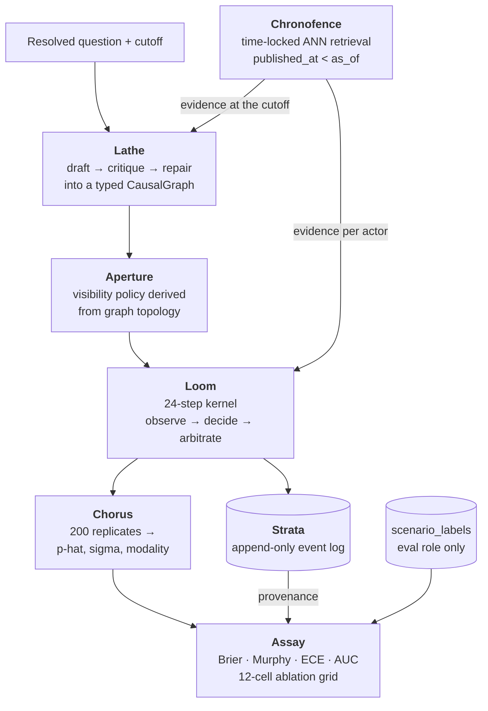

<h1 align="center">Cascade</h1>

<p align="center">
  <strong>Multi-agent causal simulation for strategic forecasting.</strong><br>
  Compile a question into a causal graph, run a seeded multi-agent simulation
  over it 200 times, and score the ensemble against what actually happened.
</p>

<p align="center">
  <a href="#status-what-is-measured-and-what-is-not"></a>
  <a href=".github/workflows/ci.yml"></a>
  <a href="#engineering-contract"></a>
  <a href="#engineering-contract"></a>
  
  
  <a href="LICENSE"></a>
</p>

---

## What this is

Most LLM forecasting systems ask a model for a probability. Cascade asks a
different question: **what would have to happen for this outcome to occur, who
would have to do it, and what do they each know?**

A question like *"will the regulator clear this merger before the deadline?"*
is compiled into a typed **causal graph** — 8–20 actors with objectives and
levers, 4–12 world factors with their own dynamics, and a monotone outcome
rule. That graph is then simulated for 24 steps: actors observe a *partial,
noisy, lagged* view of the world determined by their position in the graph,
choose actions, and a deterministic arbiter folds those actions into the next
world state. Run it 200 times from 200 seeds and the spread of terminal
outcomes is a forecast **and** a statement about how settled the question is.

Three properties are load-bearing, and each is enforced by a mechanism rather
than by discipline:

| | |
|---|---|
| **No hindsight** | Retrieval is time-locked at the database level. A query at cutoff *T* cannot return a document published at *T*. The simulation role has no `SELECT` grant on the outcomes table at all. |
| **Bit-exact replay** | One RNG per run, seeded once, drawn in a documented order. Every model call is content-addressed and replayed from disk. 25 stored runs re-run in fresh interpreters reproduce their event-log hash byte for byte. |
| **Full provenance** | Every agent decision is an append-only row carrying what it was responding to. `cascade trace explain` walks an outcome back to the exogenous shock that started it, in under a second. |

---

## Status: what is measured, and what is not

> **This section is the point of the README.** The project's first rule is that
> the report prints measured values and that no target is ever written into a
> report code path — enforced by a static check over every module on that path.
> The same rule applies here. Everything below is a number this repository
> produced; the headline study results **do not exist yet** and are not quoted.

**M0–M9 complete. M10 (model providers on AWS) is built and tested; its live
criteria are blocked** — no AWS account or pay-as-you-go key was available, and
compiling needs the corpus, which is not rebuilt on this machine. See
[Model providers](#model-providers) and [Limitations](#limitations).

### Measured

| Quantity | Measured | Where |
|---|---|---|
| Backtest scenarios | **180**, YES rate **0.5000**, no domain above **25.0%** | M1 |
| Frozen split | sealed at `91ccd314…` (re-fetched 2026-09-18, see below), re-hashed and asserted before any label is read | M1 / M10 |
| Climatology floor | Brier **0.250000** over the sealed set | M1 |
| Evidence corpus | **1,998,127** chunks across **317,780** documents (ccnews 1,985,516 / wikipedia 12,611), 0 NULL/future dates, 100% embedding coverage | M2 / M14 |
| Evidence coverage | **180/180** covered at their own cutoffs; median **1,236,969** admissible chunks in an 18-month window, minimum 327; newest evidence within a day of the cutoff for **155 of the 165 scored** scenarios, none over 30 days stale | M2 / M14 |
| Retrieval recall@20 | **0.9675** vs exhaustive search (criterion > 0.92), measured on the previous 1.95M-chunk corpus under vector-only retrieval | M3 / M8 |
| Retrieval relevance | hybrid over vector, 180 scenarios, paired bootstrap, every interval excluding zero: chunks naming a registry party **0.5508 → 0.6452** (compiler) and **0.7676 → 0.8257** (baselines); median evidence age **183 → 139** and **141 → 70** days | M14 |
| Market at the cutoff | **143** usable prices of 180 (6 stale, 21 without history, 9 not markets, 1 market created after its own cutoff) — excluded and counted, never imputed | M14 |
| Dated-text leaks found | Wikipedia renders and CC-NEWS re-crawls both carried post-cutoff text under pre-cutoff dates; **200,122** documents re-dated to their fetch time, **11,237** of them fetched over 180 days after the date they state; the update-stamp scan went **381 → 4** flagged chunks (all four publisher typos) | M14 |
| Retrieval p95 | **90.92 ms** over 10,000 queries (criterion < 15 ms — **not met**, see [Limitations](#limitations)) | M3 / M8 |
| Poison-pill leakage | **0 of 500** planted post-cutoff documents retrieved, across all 180 cutoffs | M3 |
| Prompt injection (threat T3) | a document impersonating a system notice was obeyed on **20 of 30** scenarios (95% CI [0.49, 0.81], mean shift +0.491); a plain "ignore your instructions" on **0 of 30**. After quoting documents in a frame they cannot forge ([ADR-0045](docs/adr/0045-quoted-evidence.md), prompt revision r4): **0 of 30**, intervals disjoint | M14 |
| Arbiter properties | bounded, conserving, permutation-invariant, monotone — all pass under Hypothesis | M5 |
| Replay determinism | **25/25** runs byte-identical across processes, 24.3 s; re-measured **25/25 in 8.4 s** on the rebuilt environment | M8 / M10 |
| Parametric memorization | **180/180** answers parsed; median confidence **0.70**; **directionally correct on 89/180 -- chance**; probe Brier **0.2970** against climatology's 0.2500, so the model's confident priors about these questions do not predict them. Measured through `claude_code`, **not the pinned configuration** | M3 / M14 |
| Compiled causal graphs | **155 of the 165 scored** scenarios, 594 model calls; mean 12.34 actors (14 +/- 2 criterion **met**), 7.46 factors; every stored graph re-hashes and re-validates (**155/155**); **10 hard failures**, nine of them two factors too alike on "which team wins X" questions | M4 / M14 |
| Market at the cutoff (benchmark) | Brier **0.207828** over the 107 test scenarios with a usable price, **BSS 0.1687** against climatology's 0.250000 | M14 |
| Provenance chain | complete to a root cause in **0.27 s** | M8 |
| Test suite | **1,998 passing** offline, 1 skipped; ruff, black and mypy strict clean over 117 modules. Against the rebuilt corpus: **150 integration** and **74 leakage/property** tests pass, including the poison pill planted for every scenario and never returned through the new keyword pool | all |

> **The local environment was rebuilt on 2026-09-18**, and the corpus was
> rebuilt on 2026-09-19. The Postgres volume had been lost, taking the corpus,
> the sealed registry and every stored run with it. The registry was re-fetched
> and re-sealed: 180 scenarios, YES rate 0.5000, max domain share 0.2500, at
> `91ccd314…` — a **new frozen split**, because the markets resolved since M1
> change the pool. The M1 split `30d9c61d…` is gone. The corpus figures above
> are from the rebuild; **retrieval p95 and recall have not been re-measured
> on it**, and the replay figures are from the previous environment.
>
> **15 of the 180 sealed scenarios are exchange placeholder legs** ("Will
> Candidate B win …"), which passed every registry rule because the volume
> screen read a leg's zero as missing. The sealed set is kept as sealed and
> they are excluded from every scored figure and counted, so the dev/test split
> is drawn over the remaining 165 — 40 dev, 125 test
> ([ADR-0043](docs/adr/0043-registry-placeholder-legs.md)).

### Not measured, and why

Five milestones' acceptance numbers need **540 Sonnet calls to compile 180
causal graphs**. No pay-as-you-go model provider has been available in the
environment this was built in, and compiling also needs the evidence corpus,
which is not rebuilt on this machine. Everything downstream of those graphs is
built, wired and tested against a stand-in decider; nothing downstream of a
*provider* can be measured.

- **No compiled graphs** → no agent-driven runs, so no Brier, no skill scores,
  no ablation deltas, no calibration curve.
- **The cost ledger cannot be reconciled** against Langfuse, because no stored
  run has spent anything. `cascade trace cost` **exits non-zero** rather than
  reporting that zero agrees with zero.
- Runs made with the stand-in decider are stamped `policy='heuristic'` in the
  database, and any report built from them says so **above** its own headline.

That last point is deliberate. A footnote is not a mechanism; the column is.

---

## How it works



```

Eight subsystems, each with one job:

| Subsystem | Package | Does |
|---|---|---|
| **Ledger** | `cascade/ledger/` | Builds and seals the 180-scenario registry with its base-rate and domain controls |
| **Chronofence** | `cascade/retrieval/` | Time-locked vector search — `as_of` has no default anywhere, in Python or SQL |
| **Lathe** | `cascade/decompose/` | Compiles a question into a validated `CausalGraph` (6 structural + semantic rules) |
| **Aperture** | `cascade/aperture/` | Derives who can see what from the graph's topology, with noise and lag per hop |
| **Loom** | `cascade/sim/` | The 24-step kernel and the deterministic arbiter — ~400 lines, no I/O, no LLM |
| **Chorus** | `cascade/ensemble/` | Fans out 36,000 runs in lockstep waves and collapses replicates into forecasts |
| **Assay** | `cascade/eval/` | Scoring, the 12-cell ablation grid, paired bootstrap, and the report artifact |
| **Strata** | `cascade/trace/` | Append-only event log, replay verification, provenance chains, cost ledger |

---

## Quickstart

**Prerequisites:** Docker, [uv](https://docs.astral.sh/uv/), Python 3.12.
No Anthropic key is needed for anything on this page.

```bash
git clone https://github.com/utkarsh430/cascade.git
cd cascade

make install          # uv sync --extra dev --extra kernel
make env              # writes .env from .env.example
make up               # Postgres 16 + pgvector 0.8, and Langfuse — waits for healthy
make migrate          # 16 forward-only SQL migrations
cascade doctor        # asserts the pinned stack and service health; exits 0 or tells you why
```

`cascade doctor` is the gate. It prints every pinned dependency with the
version actually installed, checks both services, and refuses to exit 0 if
anything has drifted.

> **Building the corpus or benchmarking retrieval?** Those paths need the
> embedding stack: `make install-full` adds torch and sentence-transformers
> (~2 GB). Nothing else on this page does — the model is imported lazily
> everywhere, and `cascade doctor` reports it as absent rather than failing.

---

## The 90-second demo

From a clean clone to a rendered causal trace. This runs entirely on the
deterministic stand-in decider — **no API key, no spend**. `make demo` runs all
five steps; they are spelled out here so you can see what each one proves.

```bash
# 1. Build and seal the 180-scenario registry  (~2 min, network)
cascade ledger build && cascade ledger seal

# 2. Run four ablation cells that need no compiled graph (~3 min)
#    C09-C12 are the "generic persona panel" arm, so they run without the compiler.
cascade eval grid --policy heuristic --cell C09 --cell C10 --cell C11 --cell C12 --limit 40

# 3. Prove the runs replay byte-identically in fresh processes
cascade trace replay --runs 25

# 4. Walk one outcome back to the exogenous shock that caused it
cascade trace explain          # --run is optional; defaults to the first stored run

# 5. Write the full report artifact
cascade report --headline C09
```

Step 4 prints:

```
outcome_score 0.53  <- factor 'momentum' moved last at step 23
  d0  step 23  actor=panelist_forecaster      COMMIT    +0.0007 on momentum
  d1  step 19  actor=panelist_advocate        COMMIT    +0.0007 on momentum
  ...
  d11 step  0  actor=panelist_forecaster      COMMIT    +0.0061 on momentum
  root  step  0  exogenous shock on 'resistance' +0.04
complete chain: 12 decision(s) to an exogenous shock at step 0
```

Step 5 writes `reports/study_<ts>/` with ten machine-readable files and four
SVG figures. Where a quantity could not be produced it is `null` in the JSON
and named in a **"Not produced"** section at the top of `headline.md` — never
filled in with the value the specification expects.

---

## Running the full study

Each phase is a subcommand, each is resumable, and each has a budget ceiling
that aborts rather than warns. Phases 4 onward need a model provider — see
[Model providers](#model-providers).

<details>
<summary><b>Phase-by-phase commands</b></summary>

### 1. Scenario registry (M1)
```bash
cascade ledger build       # 180 scenarios: base rate in [0.40, 0.60], no domain > 25%
cascade ledger seal        # writes manifest.sha256 — every later phase asserts it
cascade ledger verify
```

### 2. Evidence corpus (M2)
```bash
cascade corpus build       # resumable per unit; re-run until the target is met
cascade corpus verify      # exits 3 while short of 1.3M chunks
cascade corpus coverage    # evidence at each scenario's own cutoff; exits 3 when short
```

### 3. Time-locked retrieval (M3)
```bash
cascade retrieval index --drop-legacy   # one HNSW index per non-empty partition
cascade retrieval verify                # structural preconditions; exits 3 on drift
cascade retrieval bench                 # p50/p95/p99 + recall@20; exits 3 on a miss
make test-leakage                       # the poison-pill and date-monotonicity probes
```

### 4. Compile the causal graphs (M4) — *needs a key*
```bash
cascade compile build      # draft → critique → repair → validate, per scenario
cascade compile status     # graph statistics and the repair-retry histogram
cascade compile audit      # writes the seeded 20-graph human audit worksheet
```

### 5. Simulate (M5/M6) — *needs a key*
```bash
cascade simulate estimate --units 20    # dry run; exits 2 on a projected budget breach
cascade simulate all --wave 200         # the fan-out, batching each step across the wave
cascade ensemble collapse               # replicates → forecasts, label-blind
cascade ensemble convergence            # the replicate-count curve
```

### 6. Evaluate (M7) — *needs a key for 4 of 5 baselines*
```bash
cascade eval baselines --baseline climatology   # the one that needs no model
cascade eval estimate                            # baseline-phase dry run
cascade eval grid                                # all 12 Appendix C cells
cascade eval score --config-id C01
cascade eval significance
cascade report
```

### 7. Determinism and provenance (M8)
```bash
cascade trace status
cascade trace replay --runs 25          # byte-identical hashes across processes
cascade trace explain --run <run-id>    # provenance chain to a root cause
cascade trace cost                      # reconcile the ledger against Langfuse
```

</details>

### Cost

**No study cost has been measured** — no phase has spent money. The
specification's cost model sets the targets, and they are targets: the meter
reproduces its per-run derivation from token counts (**$0.003544** per run at
M0), but that is arithmetic over the cost model, not spend. The design rests on
four levers: prompt caching, a trajectory-prefix action cache, the Batch API,
and a **deterministic arbiter** that removes 864,000 model calls on its own.

Every phase has a hard ceiling in `configs/base.yaml`. A breach writes a
resumable checkpoint and exits `2`. Nothing warns.

### Model providers

Every model call goes through one module, `cascade/llm/client.py`, which is
cached, metered and traced the same way whoever serves it. `llm.provider`
chooses who does ([ADR-0028](docs/adr/0028-model-providers-behind-one-door.md)):

| Provider | Operated by | Auth | Batches | Cache namespace | Billing |
|---|---|---|---|---|---|
| `anthropic` | Anthropic | API key | yes | shared | per token |
| `aws` | Anthropic, via AWS (Claude Platform on AWS) | IAM / SigV4 | yes | shared | per token |
| `bedrock` | AWS (Amazon Bedrock) | IAM / SigV4 | **no** | shared | per token |
| `claude_code` | the Claude Code CLI, headless, under a subscription | your Claude login | **no** | **its own** | subscription (books $0) |

- **Bedrock cannot carry the simulate phase.** It has no Message Batches API,
  and the phase fits its ceiling only at the batch rate. A batch with anything
  to submit is refused before any spend (exit 3); a wave already recorded
  replays through Bedrock at no cost.
- **The three API providers share one cache namespace**, so a study recorded
  through one replays through the others — *conditional* on
  `cascade eval equivalence`, which measures whether two providers serve the
  same model against a within-provider control
  ([ADR-0029](docs/adr/0029-api-providers-share-one-cache-namespace.md)).
- **Routing is explicit, identity is ambient.** Region, workspace and endpoint
  come from `configs/base.yaml` on every call, so a stray `AWS_REGION` cannot
  redirect spend; credentials come from the standard AWS chain, so none are in
  configuration.
- **`claude_code` is not the pinned configuration** and is labelled wherever
  its results appear. The CLI cannot set `temperature` or `max_tokens`, so its
  recordings are keyed apart and can never be served as API recordings. It is
  local-only, and sized for compile, probes and small samples, not the
  36,000-run study ([ADR-0031](docs/adr/0031-claude-code-cli-provider.md)).
- **Bedrock Knowledge Bases were evaluated and rejected**: a managed knowledge
  base cannot enforce the time lock that the leakage suite verifies
  ([ADR-0030](docs/adr/0030-knowledge-bases-rejected-guardrails-deferred.md)).

```bash
# Local, on a Claude subscription (Claude Code installed and logged in):
CASCADE_LLM__PROVIDER=claude_code CASCADE_LLM__MODE=record cascade retrieval memorization

# Later, pay-as-you-go: records afresh, inherits nothing from claude_code
CASCADE_LLM__PROVIDER=anthropic CASCADE_ANTHROPIC_API_KEY=sk-ant-... CASCADE_LLM__MODE=record cascade compile build

# AWS: set providers.aws.{region,workspace_id,pricing} or providers.bedrock.{region,pricing}
cascade doctor              # shows the provider, its endpoint, and whether it can record
cascade eval equivalence --reference anthropic --candidate bedrock --limit 50
```

---

## Repository layout

```
cascade/
├─ cascade/              # the package — 98 modules, mypy strict
│  ├─ ledger/            # M1  scenario registry and manifest sealing
│  ├─ corpus/            # M2  fetch → dedupe → chunk → embed → index
│  ├─ retrieval/         # M3  Chronofence: time-locked ANN + bench + leakage probes
│  ├─ decompose/         # M4  Lathe: the CausalGraph compiler and its validator
│  ├─ aperture/          # M6  visibility policy derivation and projection
│  ├─ sim/               # M5  Loom: the 24-step kernel and the pure arbiter
│  ├─ ensemble/          # M6  Chorus: fan-out, aggregation, dip test
│  ├─ eval/              # M7  Assay: metrics, ablation grid, statistics, report
│  ├─ trace/             # M8  Strata: event log, replay, provenance, cost ledger
│  └─ llm/               # the single model call site: record / replay / live, four providers
├─ configs/              # base.yaml + the 12 ablation cell overlays
├─ migrations/           # 16 numbered, forward-only SQL migrations
├─ docs/adr/             # 31 architecture decision records
├─ tests/                # unit · property · integration · leakage · determinism
└─ reports/              # generated study artifacts
```

---

## Engineering contract

`CLAUDE.md` is the contract this repository is built against: the invariants,
the pinned stack, and a build log with one entry per milestone recording what
shipped, what the acceptance numbers **actually were**, and what was deferred.

### The nine invariants

Each is enforced by a test, not by intention.

1. **`as_of` is never defaulted** — not in Python, not in SQL, not in a test helper.
2. **The simulation never reads `scenario_labels`** — enforced by a Postgres grant, not by code review.
3. **The arbiter contains no LLM call and no I/O** — asserted statically over its imports.
4. **One RNG per run**, seeded once, drawn in a fixed documented order.
5. **One LLM call site** — a grep for the SDK import anywhere else fails CI.
6. **The event log is append-only** — no `UPDATE`, no `DELETE`, ever.
7. **All iteration over collections is sorted** — dict order is a nondeterminism vector.
8. **Every phase is resumable** — checkpoint and skip completed units on restart.
9. **No target value is ever written into a report code path** — a static check parses every module on that path and fails on any literal from the measurement contract.

### Quality gates

```bash
make ci          # ruff + black + mypy strict + the offline test suite
make test        # offline only — no services needed
make test-all    # adds integration and leakage (needs `make up`)
```

| Gate | Status |
|---|---|
| ruff | clean |
| black | clean |
| mypy strict | clean, 98 modules |
| pytest | 1,331 passing, 1 skipped |

The suite is 72 files and about 17,000 lines across five categories: unit,
Hypothesis property tests, integration against live Postgres, **leakage**
probes that plant post-cutoff documents and assert none is ever retrieved, and
**determinism** tests that re-run a scenario in subprocesses under different
hash seeds.

---

## Limitations

Stated plainly, because a result that hides these is not a result.

1. **The headline study numbers do not exist.** No causal graph has been
   compiled by a model. Every figure in [Status](#status-what-is-measured-and-what-is-not)
   comes from the infrastructure or from runs made with a deterministic
   stand-in, which the database stamps as such.
2. **Retrieval p95 misses its budget — 90.92 ms against 15 ms.** The budget was
   derived for per-step retrieval (4.2M searches); a later decision moved
   retrieval to once per *(scenario, actor)*, roughly 2,520 searches, so the
   study's entire retrieval cost is about four minutes. The criterion is still
   missed and `cascade retrieval bench` still exits 3. The remaining gap is the
   partition count, measured at **3.9 ms fixed + 0.34 ms per partition**.
3. **Metaculus is unavailable** without a token, so the registry is sourced
   from Polymarket, Manifold and a curated file — a documented deviation from
   the specification's "~90 from Metaculus".
4. **The 16 curated scenarios are not independently verified.** They are
   authored from the public record and must be checked before publication: a
   curated label nobody can check is indistinguishable from an invented one.
5. **Parametric memorization is measured only through `claude_code`**, which
   cannot set the probe's zero temperature and adds its own harness context.
   It is reported as such, not as the pinned configuration's number. A model
   that already knows how a question resolved is a floor no amount of
   time-locking removes, and the number belongs beside the headline Brier.
6. **GDELT contributed nothing.** Its API serves a rolling recent window rather
   than the archive, and this network is rate-limited beyond practical use.
7. **The AWS providers are built and tested, not run live.** Routing, SigV4
   signing, pricing and the batch refusal are verified through the real SDK
   against a mock transport; no AWS account was available, so no call has
   reached AWS, and `cascade eval equivalence` has not been run.
8. **Bedrock Guardrails are deferred.** The SDK's Bedrock client has no
   guardrail parameter, and a separate `ApplyGuardrail` call would be a second
   door outside the one the cost ledger and replay depend on.

---

## Design decisions

31 architecture decision records live in [`docs/adr/`](docs/adr/) — see the
[index](docs/adr/README.md). Fifteen correct defects in the specification;
three correct defects found in this build. A few that shaped the system:

| ADR | Decision |
|---|---|
| [0002](docs/adr/0002-chronofence-security-definer.md) | `chronofence_search` needs `SECURITY DEFINER`; as specified the app role gets a permission error on its own function |
| [0005](docs/adr/0005-role-grants-deny-by-default.md) | Role grants deny by default — the spec's `REVOKE … FROM cascade_sim` is a no-op |
| [0015](docs/adr/0015-run-rng-draw-plan.md) | The whole step's randomness is drawn at once, so an ablation runs the identical stream through a different policy |
| [0019](docs/adr/0019-evidence-in-the-cached-prefix.md) | Evidence is retrieved once per (scenario, actor), not per step — 4.2M searches become 2,520 |
| [0023](docs/adr/0023-corpus-unit-granularity-and-demand-ordering.md) | Ingest order is a correctness concern: chronological units left a 1.76M-chunk corpus covering the wrong decade |
| [0025](docs/adr/0025-ablation-factors-a-and-c.md) | Two of four ablation factors were configuration fields nothing read — six of twelve cells would have been duplicates |
| [0026](docs/adr/0026-hnsw-and-bounded-candidate-pool.md) | HNSW replaces IVFFlat, and a parameterised `LIMIT` in a non-inlinable function cost 4× |

---

## Contributing

See [CONTRIBUTING.md](CONTRIBUTING.md). The short version: one milestone per
change, acceptance criteria written as failing tests first, and if a criterion
cannot be met — **stop and report the measured value with a diagnosis**. Do not
relax the criterion, do not add a tolerance, do not mark it approximately
passing.

## License

[MIT](LICENSE).
