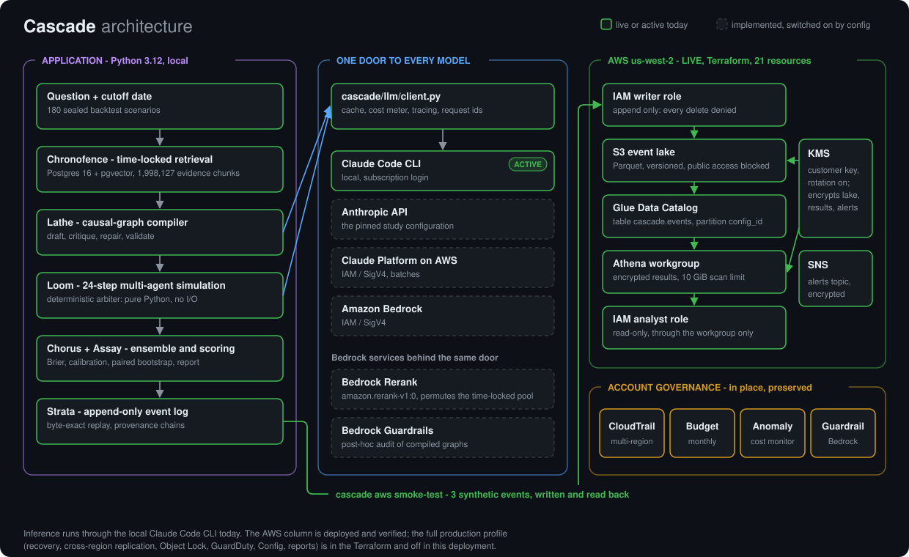
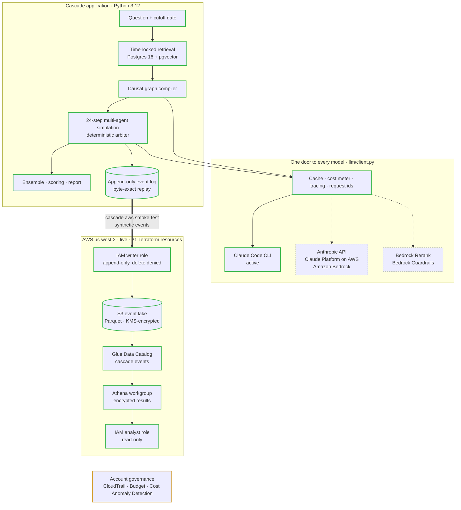
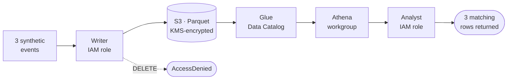
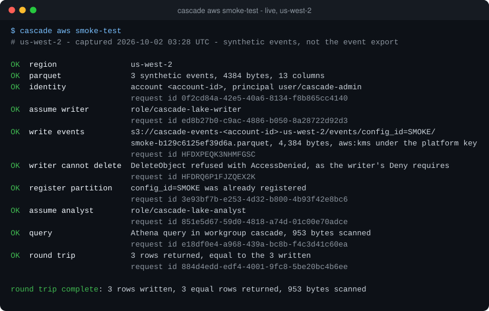
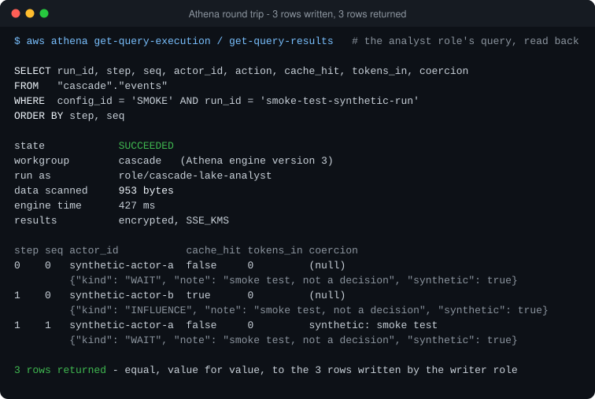
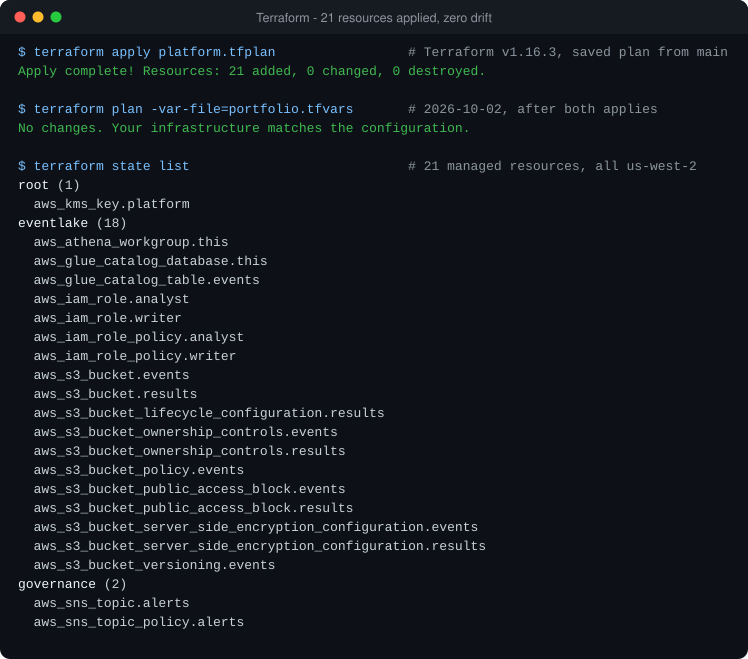
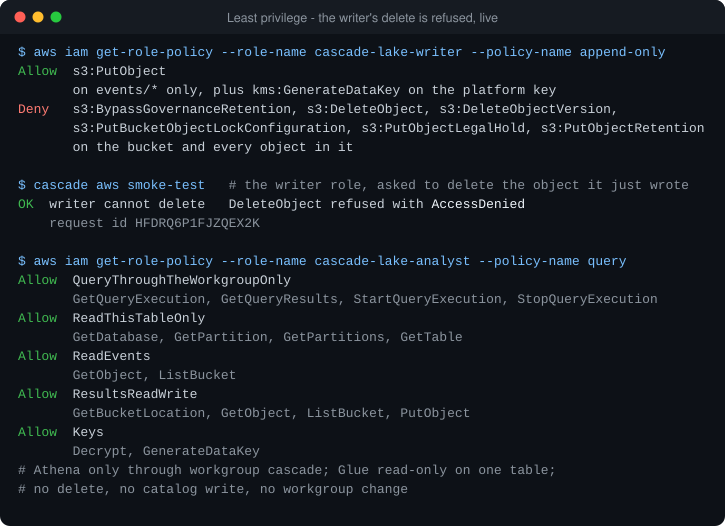
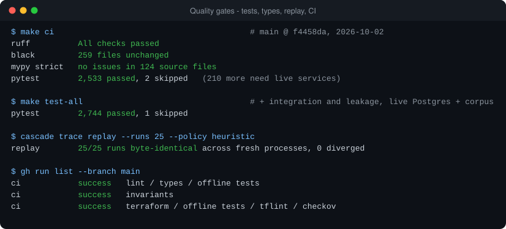

<h1 align="center">Cascade</h1>

<p align="center">
  <strong>Multi-agent causal simulation for strategic forecasting, built on time-locked evidence, byte-exact replay, and a live, Terraform-managed AWS analytics plane.</strong>
</p>

<p align="center">
  Cascade turns a real-world question into a causal graph of actors and forces, simulates it with
  LLM agents that can only see evidence published before the question's cutoff date, and scores the
  forecast against what actually happened. Every model call is recorded, every run replays to the
  same hash, and every decision traces back to its cause. Its event log has a home on AWS: an
  encrypted S3 lake behind Glue and Athena, deployed with Terraform and proven end to end by one command.
</p>

<p align="center">
  <a href="https://github.com/utkarsh430/cascade/actions/workflows/ci.yml"></a>
  
  
  
  
  
  <a href="LICENSE"></a>
</p>

<table align="center">
  <tr>
    <td align="center"><h3>2,533</h3>automated tests<br>passing</td>
    <td align="center"><h3>21</h3>live AWS resources,<br>Terraform-managed</td>
    <td align="center"><h3>3 / 3</h3>rows verified through<br>S3 → Glue → Athena</td>
    <td align="center"><h3>0</h3>Terraform drift<br>after deployment</td>
    <td align="center"><h3>1,027</h3>infrastructure security<br>checks, 0 failed</td>
    <td align="center"><h3>25 / 25</h3>simulation runs replayed<br>byte for byte</td>
  </tr>
</table>

<p align="center"><sub>These six numbers were re-measured on 2026-10-02 against <code>main</code> and the live AWS account. The outputs are in the <a href="docs/evidence/README.md">evidence pack</a>.</sub></p>

---

## What is Cascade?

Most AI forecasting asks a model for a probability. Cascade models **why** an outcome would
happen: who has to act, what each of them wants, and what each of them can see.

- **The problem.** Strategic questions — *will the regulator clear this merger before the
  deadline?* — turn on several actors reacting to each other. A single prompt hides that structure,
  cannot be replayed, and can quietly use knowledge from after the fact.
- **The system.** Cascade compiles a question into a typed causal graph (actors, objectives,
  world factors), runs a 24-step multi-agent simulation over it from many seeds, and turns the
  spread of outcomes into a forecast that is scored against the real resolution.
- **The intelligence layer.** LLM agents make the decisions; a deterministic arbiter applies them.
  All model access goes through one audited door with caching, cost metering and request-ID
  tracing, behind which four providers are interchangeable.
- **The AWS data and governance layer.** The simulation's event log lands in a KMS-encrypted S3
  lake, catalogued by Glue and queried through Athena, with separate writer and analyst roles —
  all deployed and managed by Terraform, alongside CloudTrail, budget and cost-anomaly monitoring.

## Highlights

- **A real AWS deployment, managed end to end by Terraform** — 21 resources in `us-west-2`,
  applied from a reviewed plan, with zero drift on the plan that followed.
- **Proven live in one command** — `cascade aws smoke-test` writes events as Parquet, queries
  them back through Glue and Athena, and checks the rows match: 3 written, 3 returned.
- **Least privilege that is tested, not assumed** — the writer role's `DELETE` is refused with
  `AccessDenied` on every run; the analyst role can only query, and only through the workgroup.
- **Evidence that cannot see the future** — retrieval over 1,998,127 evidence chunks is
  time-locked in the database itself, and the leakage suite plants post-cutoff documents to prove
  none comes back.
- **Byte-exact reproducibility** — 25 of 25 stored simulation runs replay to an identical
  event-log hash in fresh processes; any outcome can be walked back to its root cause.
- **One door to every model** — Claude Code CLI, Anthropic API, Claude Platform on AWS and Amazon
  Bedrock behind a single interface; switching provider is configuration, not code.
- **Amazon Bedrock integrated where it is safe** — Rerank as a permutation of the time-locked
  pool, Guardrails as a post-hoc audit, both with AWS request-ID observability.
- **Engineering rigor you can check** — 2,533 tests, `mypy --strict` over 124 modules, 193
  Terraform tests, 1,027 passing security checks, 54 architecture decision records, green CI.

## Architecture

<p align="center">
  
</p>

Solid green is running today; dashed is implemented and switched on by configuration. Inference
currently runs through the local Claude Code CLI; the AWS column is deployed and verified.
The deeper walkthrough is in [docs/ARCHITECTURE.md](docs/ARCHITECTURE.md).

<details>
<summary><b>The same architecture as a Mermaid diagram</b></summary>


```mermaid
flowchart TB
  subgraph APP["Cascade application · Python 3.12"]
    Q["Question + cutoff date"] --> R["Time-locked retrieval<br/>Postgres 16 + pgvector"]
    R --> G["Causal-graph compiler"]
    G --> SIM["24-step multi-agent simulation<br/>deterministic arbiter"]
    SIM --> EV["Ensemble · scoring · report"]
    SIM --> LOG[("Append-only event log<br/>byte-exact replay")]
  end

  subgraph LLM["One door to every model · llm/client.py"]
    DOOR["Cache · cost meter · tracing · request ids"]
    DOOR --> CLI["Claude Code CLI<br/>active"]
    DOOR -.-> ALT["Anthropic API<br/>Claude Platform on AWS<br/>Amazon Bedrock"]
    DOOR -.-> RG["Bedrock Rerank<br/>Bedrock Guardrails"]
  end

  subgraph AWS["AWS us-west-2 · live · 21 Terraform resources"]
    W["IAM writer role<br/>append-only, delete denied"] --> S3[("S3 event lake<br/>Parquet · KMS-encrypted")]
    S3 --> GL["Glue Data Catalog<br/>cascade.events"]
    GL --> ATH["Athena workgroup<br/>encrypted results"]
    ATH --> AN["IAM analyst role<br/>read-only"]
  end

  GOV["Account governance<br/>CloudTrail · Budget · Cost Anomaly Detection"]

  G --> DOOR
  SIM --> DOOR
  LOG == "cascade aws smoke-test<br/>synthetic events" ==> W
  AN ~~~ GOV

  classDef live stroke:#3fb950,stroke-width:2px;
  classDef ready stroke:#8b949e,stroke-dasharray:4 3;
  classDef gov stroke:#d29922,stroke-width:2px;
  class Q,R,G,SIM,EV,LOG,DOOR,CLI,W,S3,GL,ATH,AN live;
  class ALT,RG ready;
  class GOV gov;
```

</details>

## Proven live on AWS

`cascade aws smoke-test` is a deterministic, end-to-end proof that the deployed lake works, run
as the lake's own IAM roles rather than as an administrator.


```mermaid
flowchart LR
  E["3 synthetic<br/>events"] --> W["Writer<br/>IAM role"]
  W --> S3[("S3 · Parquet<br/>KMS-encrypted")]
  S3 --> GL["Glue<br/>Data Catalog"]
  GL --> ATH["Athena<br/>workgroup"]
  ATH --> AN["Analyst<br/>IAM role"]
  AN --> OK(["3 matching<br/>rows returned"])
  W -. "DELETE" .-> X(["AccessDenied"])
```

| Measured in the latest run (2026-10-02, `us-west-2`) | |
|---|---|
| Events written, as the **writer role** | **3**, as one Parquet file — 4,384 bytes, 13 columns, encrypted with `aws:kms` |
| Writer attempts to delete the object it just wrote | **refused: `AccessDenied`** — least privilege enforced by the live policy |
| Catalog | partition registered in the Glue table `cascade.events` |
| Query, as the **analyst role**, through the Athena workgroup | **SUCCEEDED** — 953 bytes scanned, 427 ms engine time, results encrypted |
| Round trip | **3 rows returned, equal value for value to the 3 written** |
| Traceability | an AWS request ID recorded for every call |

<p align="center">
  
</p>

The smoke test uses three clearly labelled synthetic events: it proves the S3, KMS, Glue, Athena
and IAM path end to end. Continuous export of the full event log is the next step.

## Evidence

Captured output from the live account and from `main`, sanitized and indexed in
[docs/evidence](docs/evidence/README.md).

<table>
  <tr>
    <td width="50%"><a href="docs/evidence/athena-roundtrip.svg"></a><br><sub><b>Athena round trip</b> — the analyst role's query and the three rows it returned.</sub></td>
    <td width="50%"><a href="docs/evidence/terraform-no-drift.svg"></a><br><sub><b>Terraform</b> — 21 resources applied, and no changes on the next plan.</sub></td>
  </tr>
  <tr>
    <td width="50%"><a href="docs/evidence/least-privilege.svg"></a><br><sub><b>Least privilege</b> — the writer's policy, and its delete refused live.</sub></td>
    <td width="50%"><a href="docs/evidence/quality-gates.svg"></a><br><sub><b>Quality gates</b> — tests, strict typing, byte-exact replay and CI.</sub></td>
  </tr>
</table>

## Security by design

| Control | How it is enforced | How it is verified |
|---|---|---|
| Encryption at rest | One customer-managed KMS key, rotation on, for the event lake, Athena results and the alerts topic | Read back from the live buckets and key |
| No public data | All four S3 public-access blocks on every bucket; TLS-only bucket policy | Read back live; asserted by Terraform tests |
| Append-only event lake | The writer role may `PutObject` and is explicitly denied every delete and lock override | **Tested live on every smoke-test run: `DeleteObject` → `AccessDenied`** |
| Read-only analytics | The analyst role queries one table, through one Athena workgroup that enforces encryption and a 10 GiB scan limit | The smoke test runs its query as that role |
| No hindsight | `published_at < as_of` enforced inside the database; the simulation's role has no grant on the outcomes table | Leakage suite: planted post-cutoff documents are never retrieved |
| Prompt-injection resistance | Retrieved documents are quoted in a frame they cannot forge | Measured: obeyed on 20 of 30 scenarios before, 0 of 30 after |
| Model-output screening | Amazon Bedrock Guardrails audit compiled graphs after the fact, never silently altering them | `cascade aws check` resolves the guardrail live |
| Observability | Provider and AWS request IDs kept on every call, recording and trace | Shown in the smoke-test output |
| Infrastructure scanning | Checkov, TFLint and 193 mock-provider Terraform tests in CI | 1,027 passed, 0 failed |
| Account governance | CloudTrail, an AWS Budget and Cost Anomaly Detection in the account | Read back live, unchanged by the deployment |

## Infrastructure: one codebase, two profiles

The same Terraform supports a cost-efficient demonstration profile while retaining the
production-grade recovery and governance modules. Every production tier is a switch, on by
default; the committed [`portfolio.tfvars`](infra/terraform/envs/platform/portfolio.tfvars)
turns them off for the live demo.

| Capability | Full configuration (in the codebase) | Live portfolio deployment |
|---|:-:|:-:|
| KMS key, S3 event lake, Athena results bucket | ✅ | ✅ **live** |
| Glue catalog and table, Athena workgroup | ✅ | ✅ **live** |
| Writer and analyst IAM roles | ✅ | ✅ **live** |
| SNS alerts topic | ✅ | ✅ **live** |
| S3 Object Lock on the lake and reports | ✅ | available, off |
| Tier-0 recovery archive with cross-region replication | ✅ | available, off |
| Reports bucket | ✅ | available, off |
| GuardDuty and AWS Config | ✅ | available, off |
| Isolated VPC, Aurora PostgreSQL Serverless v2, Fargate tasks | ✅ | available, not deployed |

Three roots, 15 modules, pinned Terraform 1.16.3. Standing cost of the live deployment is one
KMS key; everything else bills only when used. Details: [infra/terraform](infra/terraform/README.md)
and [ADR-0054](docs/adr/0054-a-portfolio-deployment-profile.md).

## Tech stack

| Layer | What is used |
|---|---|
| **AI / LLM** | Claude (Haiku 4.5 agents, Sonnet 4.6 compiler) through a four-provider abstraction: Claude Code CLI (active), Anthropic API, Claude Platform on AWS, Amazon Bedrock; Bedrock Rerank and Bedrock Guardrails |
| **Application** | Python 3.12, LangGraph, Pydantic v2, Typer + Rich, PostgreSQL 16 + pgvector, `bge-small-en-v1.5` embeddings, PyArrow |
| **AWS** | S3, KMS, Glue, Athena, IAM, SNS, CloudTrail, Budgets, Cost Anomaly Detection, Bedrock |
| **Infrastructure** | Terraform 1.16.3 (AWS provider 6.65.0), TFLint, Checkov, Docker Compose |
| **Engineering** | pytest + Hypothesis, mypy strict, ruff, black, uv, GitHub Actions |

## Demo

The fastest way to see it work, with AWS credentials for the deployed account:

```bash
cascade aws check         # identity, guardrail and reranker resolve; invokes nothing
cascade aws smoke-test    # 3 events → S3 → Glue → Athena → 3 matching rows
```

`check` prints four green rows. `smoke-test` prints ten, ending in
`round trip complete`, with the writer's delete refused along the way and a request ID
beside every AWS call. Both take seconds and cost a fraction of a cent.

No AWS account? The application has its own no-key demo, on the deterministic stand-in agents:

```bash
make demo                 # registry → simulation cells → 25-run replay → causal trace → report
```

A timed five-minute walkthrough, with a fallback that needs no network, is in
[docs/DEMO.md](docs/DEMO.md).

## Quick start

Prerequisites: Docker, [uv](https://docs.astral.sh/uv/) and Python 3.12.

```bash
git clone https://github.com/utkarsh430/cascade.git && cd cascade

make install      # uv sync --extra dev --extra kernel --extra aws
make env          # writes .env from .env.example
make up           # Postgres 16 + pgvector and Langfuse, waits for healthy
make migrate      # 21 forward-only SQL migrations
cascade doctor    # pinned stack, provider, AWS surfaces, service health
make ci           # ruff, black, mypy strict and the offline test suite
```

For the AWS smoke test, add the Parquet writer:
`uv sync --extra dev --extra kernel --extra aws --extra analytics`.
To deploy the lake to your own account, follow the
[infrastructure runbook](infra/terraform/README.md).

## Repository map

```
cascade/
├─ cascade/                 # the application package, mypy strict
│  ├─ retrieval/            # time-locked hybrid retrieval and reranking
│  ├─ decompose/            # the causal-graph compiler and validator
│  ├─ sim/  aperture/       # the simulation kernel, the arbiter, who can see what
│  ├─ ensemble/  eval/      # ensembles, scoring, statistics, the report
│  ├─ trace/                # event log, replay, provenance, the AWS lake smoke test
│  └─ llm/                  # the single model door: four providers, Bedrock services
├─ infra/terraform/         # 3 roots, 15 modules, mock-provider tests
├─ docs/                    # architecture, demo script, evidence, results, 54 ADRs
├─ migrations/              # forward-only SQL
├─ configs/                 # base configuration and experiment overlays
└─ tests/                   # unit · property · integration · leakage · determinism
```

## Current validated scope

What exists and has been verified today:

| Area | Validated |
|---|---|
| **AWS analytics plane** | Deployed by Terraform in `us-west-2`; 21 resources; no drift; S3 → Glue → Athena round trip proven with synthetic events as the lake's own roles |
| **Inference** | Runs through the locally authenticated Claude Code CLI; Claude Platform on AWS, the Anthropic API and Bedrock are implemented behind the same interface and tested against the real SDKs |
| **Bedrock services** | Rerank and Guardrails integrated and tested against the service models; the account's guardrail and the rerank model resolve live |
| **Evidence engine** | 1,998,127 chunks from 317,780 documents, fully embedded, time-locked at the database |
| **Simulation platform** | 180 sealed backtest scenarios; 2,850 stored runs and 520,455 logged decisions; 25 of 25 replays byte-identical |
| **Evaluation harness** | The first full study ran end to end — 360 simulations, 66,231 model calls — and reports what it measured: on 36 development scenarios Cascade (Brier 0.2197), a single model (0.2069) and the base rate (0.2500) are statistically indistinguishable. The held-out test set is untouched |

The complete record, including every measured figure and its boundaries, is in
[docs/RESULTS.md](docs/RESULTS.md).

## Next evolution

- Continuous export of the simulation event log into the lake
- Automated partition registration for new experiment cells
- Enabling Claude Platform on AWS as the inference provider
- A larger evaluation run on the held-out test set

## Documentation

| | |
|---|---|
| [Architecture](docs/ARCHITECTURE.md) | Components, data flow, IAM separation, Terraform profiles, the provider layer |
| [Demo script](docs/DEMO.md) | A five-minute presentation, with exact commands and an offline fallback |
| [Evidence pack](docs/evidence/README.md) | Every proof artifact, what produced it and what it shows |
| [Results](docs/RESULTS.md) | Every measured number, and the boundaries of what was measured |
| [Infrastructure runbook](infra/terraform/README.md) | Deploying, the two profiles, cost |
| [Decision records](docs/adr/README.md) | 54 ADRs: each decision, its evidence and its cost |
| [Threat model](docs/architecture/threat-model.md) · [Well-Architected review](docs/architecture/well-architected.md) | Security and operations in depth |
| [Build log](CLAUDE.md) · [Changelog](CHANGELOG.md) · [Contributing](CONTRIBUTING.md) | The engineering contract and the milestone-by-milestone record |

## License

[MIT](LICENSE)
