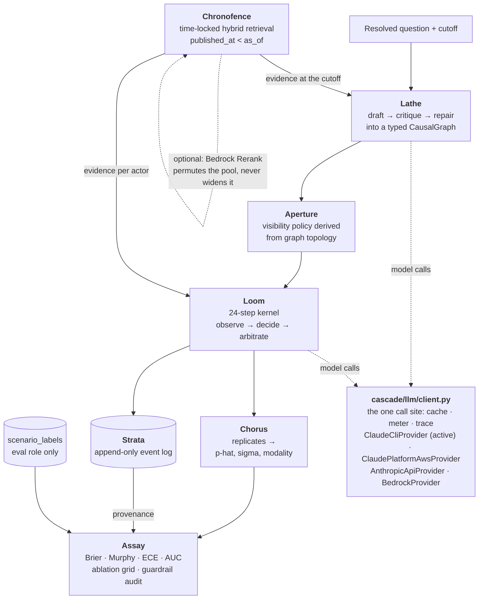

<h1 align="center">Cascade</h1>

<p align="center">
  <strong>Multi-agent causal simulation for strategic forecasting.</strong><br>
  Compile a question into a causal graph, run a seeded multi-agent simulation
  over it many times, and score the ensemble against what actually happened.
</p>

<p align="center">
  <a href="#status-what-was-measured-and-what-was-not"></a>
  <a href=".github/workflows/ci.yml"></a>
  <a href="#engineering-contract"></a>
  
  
  
  <a href="LICENSE"></a>
</p>

---

## What this is

Most LLM forecasting systems ask a model for a probability. Cascade asks a
different question: **what would have to happen for this outcome to occur, who
would have to do it, and what do they each know?**

A question like *"will the regulator clear this merger before the deadline?"*
is compiled into a typed **causal graph** — 8–20 actors with objectives and
levers, 4–12 world factors with their own dynamics, and a monotone outcome
rule. That graph is then simulated for 24 steps: actors observe a *partial,
noisy, lagged* view of the world determined by their position in the graph,
choose actions, and a deterministic arbiter folds those actions into the next
world state. Run it from many seeds and the spread of terminal outcomes is a
forecast **and** a statement about how settled the question is.

Three properties are load-bearing, and each is enforced by a mechanism rather
than by discipline:

| | |
|---|---|
| **No hindsight** | Retrieval is time-locked at the database level. A query at cutoff *T* cannot return a document published at *T*. The simulation role has no `SELECT` grant on the outcomes table at all. |
| **Bit-exact replay** | One RNG per run, seeded once, drawn in a documented order. Every model call is content-addressed and replayed from disk. 25 stored runs re-run in fresh interpreters reproduce their event-log hash byte for byte. |
| **Full provenance** | Every agent decision is an append-only row carrying what it was responding to. `cascade trace explain` walks an outcome back to the exogenous shock that started it, in under a second. |

This is an **engineering portfolio project**. The research study it was built
to run was executed once, on the development partition, and returned a null
result (below). Nothing on this page is a target; every number is one this
repository measured.

---

## Status: what was measured, and what was not

> The project's first rule is that reports print measured values and that no
> target is ever written into a report code path — enforced by a static check
> over every module on that path. The same rule applies here.

**M0–M16 are complete; M17 finished the repository as a portfolio.** The
first full study (M16) ran with a real model deciding every turn, through the
Claude Code CLI under a subscription, on 36 of the 40 development scenarios.

### The study result

| | Brier | 95% CI of the difference vs Cascade | p |
|---|---|---|---|
| Climatology (base rate) | **0.250000** | [−0.09714, +0.04265] | 0.3912 |
| Single model, same evidence | **0.206903** | [−0.08526, +0.11007] | 0.7950 |
| **Cascade** (36 dev scenarios, 10 replicates, 360 runs, 66,231 model calls) | **0.219709** | — | — |

At 36 scenarios no pairwise comparison is distinguishable from zero. The point
estimates order single model < Cascade < climatology and every interval
straddles zero, so the honest statement is that **this study cannot
distinguish the three**, not that Cascade is worse. The per-scenario
difference has SD ≈ 0.30; detecting the effect the specification hoped for
needed n ≈ 180 (the size the registry was built to), and detecting the
effect actually measured would need n ≈ 2,000. The 125 test scenarios are
deliberately unspent. Details and the power arithmetic: the M16 entry in
[`CLAUDE.md`](CLAUDE.md).

### Measured

| Quantity | Measured | Where |
|---|---|---|
| Backtest scenarios | **180**, YES rate **0.5000**, no domain above **25.0%**; sealed at `91ccd314…` and re-hashed before any label is read. **15** are exchange placeholder legs, excluded from scoring and counted, so **165** are scored: **40 dev / 125 test**, declared before any forecast existed | M1 / M10 / M14 |
| Evidence corpus | **1,998,127** chunks across **317,780** documents (ccnews 1,985,516 / wikipedia 12,611); 0 NULL or future dates; 100% embedded; **180/180** scenarios covered at their own cutoffs | M2 / M14 |
| Time lock | **0 of 500** planted post-cutoff documents retrieved across all 180 cutoffs, through the vector, keyword and rerank paths; two dated-text leaks (Wikipedia renders, CC-NEWS re-crawls) found and repaired in place, **200,122** documents re-dated | M3 / M14 / M15 |
| Retrieval | recall@20 **0.9675** against exhaustive search (criterion > 0.92, met); p95 **90.92 ms** (criterion < 15 ms, **not met** — see Limitations); hybrid over vector raised party-naming chunks **0.55 → 0.65** (compiler) and **0.77 → 0.83** (agents) | M3 / M8 / M14 |
| Compiled causal graphs | **155 of the 165** scored scenarios, 594 compiler calls; mean **12.34** actors (criterion 14 ± 2, met), **7.46** factors; every stored graph re-hashes and re-validates; 10 hard failures, nine of them two factors too alike on "which team wins X" questions | M4 / M14 |
| Parametric memorization | **180/180** answers parsed; directionally correct on **89/180** — chance; probe Brier **0.2970** against climatology's 0.2500. Measured through the CLI provider, **not the pinned configuration** | M3 / M14 |
| Prompt injection (threat T3) | a document impersonating a system notice was obeyed on **20 of 30** scenarios; after quoting documents in a frame they cannot forge ([ADR-0045](docs/adr/0045-quoted-evidence.md)): **0 of 30**, intervals disjoint | M14 |
| Market at the cutoff | Brier **0.207828** over the 107 test scenarios with a usable price, BSS **0.1687** against climatology — the bar the study had to clear | M14 |
| Activation rate / action-cache hit rate | **0.6301** (criterion 0.347 ± 0.04, **failed**) and **0.0746** (criterion ≥ 0.88, **failed**) — both trace to the compiler returning factor volatility of median 0.06, which M5 had predicted would produce exactly this | M16 |
| Arbiter properties | bounded, conserving, permutation-invariant, monotone — all pass under Hypothesis | M5 |
| Replay determinism | **25/25** runs byte-identical across processes | M8 / M10 |
| Provenance chain | complete to a root cause in **0.27 s** | M8 |
| Infrastructure gates | Terraform **1.16.3** in Docker: 3 roots validate; **62** sandbox and **112** platform mock-provider runs pass; TFLint clean; Checkov clean with every skip justified in place | M11–M17 |
| Test suite | **2,491** offline tests pass; ruff, black and mypy strict clean over **123** source modules. Against the live database and corpus: `make verify` exit 0; the integration, leakage and property suites pass (one first-pass failure traced to 2,492 stored digests that predated M16's hash-domain change — refreshed from the untouched events by `cascade trace rehash`); the first 25 stand-in runs replay byte-identically in fresh processes | all |

### Not measured, and why

- **The 12-cell ablation grid, the self-consistency baseline and the 125 test
  scenarios.** Eight cells were never run; the baseline is 36,000 calls; the
  partition can be spent once and a run of the same size would, on the
  measured effect, return the same answer.
- **Anything through AWS.** Claude Platform on AWS is implemented and tested
  against the real SDK over a mock transport and has never received a call;
  the account is being provisioned. The Bedrock reranker and guardrail are
  integrated and tested against the installed service models; neither the
  rerank benchmark nor the guardrail audit has been run against the account.
- **The cost ledger reconciliation.** Every stored run was made through the
  CLI under a subscription, which bills no tokens, so there is nothing to
  reconcile and `cascade trace cost` exits 3 rather than passing on zero
  against zero.

---

## How it works


```mermaid
flowchart TD
  Q["Resolved question + cutoff"] --> L["<b>Lathe</b><br/>draft → critique → repair<br/>into a typed CausalGraph"]
  C["<b>Chronofence</b><br/>time-locked hybrid retrieval<br/>published_at &lt; as_of"] -->|"evidence at the cutoff"| L
  C -. "optional: Bedrock Rerank<br/>permutes the pool, never widens it" .-> C
  L --> A["<b>Aperture</b><br/>visibility policy derived<br/>from graph topology"]
  A --> K["<b>Loom</b><br/>24-step kernel<br/>observe → decide → arbitrate"]
  C -->|"evidence per actor"| K
  K --> E[("<b>Strata</b><br/>append-only event log")]
  K --> CH["<b>Chorus</b><br/>replicates →<br/>p-hat, sigma, modality"]
  CH --> AS["<b>Assay</b><br/>Brier · Murphy · ECE · AUC<br/>ablation grid · guardrail audit"]
  E -->|"provenance"| AS
  LB[("scenario_labels<br/>eval role only")] --> AS
  P["<b>cascade/llm/client.py</b><br/>the one call site: cache · meter · trace<br/>ClaudeCliProvider (active) · ClaudePlatformAwsProvider<br/>AnthropicApiProvider · BedrockProvider"]
  L -. "model calls" .-> P
  K -. "model calls" .-> P
```

Eight subsystems, each with one job, and one door to every model:

| Subsystem | Package | Does |
|---|---|---|
| **Ledger** | `cascade/ledger/` | Builds and seals the 180-scenario registry with its base-rate and domain controls |
| **Chronofence** | `cascade/retrieval/` | Time-locked vector + keyword search — `as_of` has no default anywhere, in Python or SQL; an optional reranker permutes the pool |
| **Lathe** | `cascade/decompose/` | Compiles a question into a validated `CausalGraph` (6 structural + semantic rules) |
| **Aperture** | `cascade/aperture/` | Derives who can see what from the graph's topology, with noise and lag per hop |
| **Loom** | `cascade/sim/` | The 24-step kernel and the deterministic arbiter — pure Python, no I/O, no LLM |
| **Chorus** | `cascade/ensemble/` | Fans runs out in lockstep waves and collapses replicates into forecasts |
| **Assay** | `cascade/eval/` | Scoring, the ablation grid, paired bootstrap, the guardrail audit, the report artifact |
| **Strata** | `cascade/trace/` | Append-only event log, replay verification, provenance chains, cost ledger |
| **LLM** | `cascade/llm/` | The single call site: record / replay / live, four providers behind one interface, cost meter, tracing |

---

## Model providers

Every model call goes through one module, `cascade/llm/client.py`, which is
cached, metered and traced the same way whoever serves it
([ADR-0028](docs/adr/0028-model-providers-behind-one-door.md),
[ADR-0053](docs/adr/0053-portfolio-completion-provider-interface-and-region.md)).
Each provider is a class implementing one interface, `ModelProvider`;
`LLM_PROVIDER` in `.env` chooses which:

| `LLM_PROVIDER` | Class | Operated by | Auth | Batches | Cache namespace | Status |
|---|---|---|---|---|---|---|
| `claude_cli` | `ClaudeCliProvider` | the Claude Code CLI (`claude -p`), headless | your Claude login, never read by this project | no | **its own** | **ACTIVE** — the current provider ([ADR-0031](docs/adr/0031-claude-code-cli-provider.md)) |
| `anthropic` | `AnthropicApiProvider` | Anthropic | API key | yes | shared | the pinned study configuration; needs a pay-as-you-go key |
| `claude_platform_aws` | `ClaudePlatformAwsProvider` | Anthropic, via AWS (Claude Platform on AWS) | IAM / SigV4 | yes | shared | implemented and mock-tested; **not enabled** — account provisioning pending |
| `bedrock` | `BedrockProvider` | AWS (Amazon Bedrock) | IAM / SigV4 | **no** | shared | implemented and mock-tested; cannot carry a batched phase |

`aws` and `claude_code` are accepted as aliases of the last two names.

**Claude currently runs through the locally authenticated Claude Code CLI.**
The CLI is run in its documented print mode with tools, settings and MCP
servers disabled and thinking off; the subscription's token is never
extracted, stored or handled by this code. The CLI cannot set `temperature` or
`max_tokens`, so its recordings are keyed apart and every number produced
through it is labelled *not the pinned configuration*.

**Switching to Claude Platform on AWS later is configuration, not code:**

```bash
LLM_PROVIDER=claude_platform_aws
ANTHROPIC_AWS_WORKSPACE_ID=wrkspc_...        # the workspace the calls bill to; not a credential
# plus the model price table under providers.claude_platform_aws in configs/base.yaml
```

Credentials come from the standard AWS chain; the region comes from
`configs/base.yaml` and from nowhere else, so a stray `AWS_REGION` cannot
redirect spend.

---

## AWS integrations

Everything regional is in **us-west-2**. Claude inference does **not** run
through AWS today; what does is below.

| Surface | What it is | Where |
|---|---|---|
| **Bedrock Rerank** | `amazon.rerank-v1:0` as a second ranking stage over the time-locked pool. Admissible because it is handed document *bodies* and returns numbers — it cannot name a chunk the database did not return ([ADR-0047](docs/adr/0047-reranking-is-a-permutation.md)). Opt-in through `configs/tuning/rerank_bedrock.yaml`; recorded and replayed like a model call; billed one search unit per 100 documents, the service's own rule | `BedrockReranker` in `cascade/llm/client.py` |
| **Bedrock Guardrails** | The account's `cascade-audit-guardrail`, applied through `ApplyGuardrail` to every compiled graph *after* compilation and never inside it, so the audit can tell *not assessed* from *assessed and clear* and a guardrail that would alter a graph is reported as a confound ([ADR-0050](docs/adr/0050-guardrails-measured-not-applied.md)). `CASCADE_GUARDRAIL_ID` / `CASCADE_GUARDRAIL_VERSION=1` in `.env` | `BedrockGuardrail`; `cascade eval guardrails` |
| **Terraform** | 3 roots and 16 modules: an isolated VPC with interface endpoints, Aurora PostgreSQL 16 Serverless v2 with pgvector pinned, KMS keys, S3 (state, artifacts, an Object-Locked event lake, recovery and reports buckets), least-privilege IAM, Fargate tasks, a budget derived from the study configuration, CloudTrail, GuardDuty, the Bedrock guardrail, optional SCPs. Gated offline with mock-provider tests, TFLint and Checkov | [`infra/terraform/`](infra/terraform/README.md) |
| **Observability** | Every call carries the provider's request id (`request-id`, `x-amzn-requestid`, or the CLI's session) on the result, the recording and the trace; `observability.call_log` appends one JSON object per call; Langfuse traces when configured | `cascade/llm/tracing.py` |
| **`cascade aws check`** | Three control-plane reads — the caller's identity, the configured guardrail, the configured reranker — that invoke nothing and spend nothing; exit 3 on any failure | `describe_aws_access` |

Bedrock Knowledge Bases ([ADR-0030](docs/adr/0030-knowledge-bases-rejected-guardrails-deferred.md))
and Bedrock Agents ([ADR-0051](docs/adr/0051-bedrock-agents-rejected.md)) were
evaluated and rejected: neither can hold the `as_of` time lock the leakage
suite verifies.

---

## Quickstart

**Prerequisites:** Docker, [uv](https://docs.astral.sh/uv/), Python 3.12, and
— for the current provider — [Claude Code](https://claude.com/claude-code)
installed and logged in (`claude` then `/login`). No API key and no AWS
account are needed for anything on this page.

```bash
git clone https://github.com/utkarsh430/cascade.git
cd cascade

make install          # uv sync --extra dev --extra kernel --extra aws
make env              # writes .env from .env.example  (LLM_PROVIDER=claude_cli)
make up               # Postgres 16 + pgvector 0.8, and Langfuse — waits for healthy
make migrate          # 21 forward-only SQL migrations
cascade doctor        # pinned stack, provider, AWS surfaces, service health; exits 0 or says why
```

`cascade doctor` is the gate. It prints every pinned dependency with the
version actually installed, the active provider and whether it can record, the
AWS region and the two Bedrock surfaces, and refuses to exit 0 if anything has
drifted.

With AWS credentials in the standard chain, `cascade aws check` confirms the
identity and that the configured guardrail and reranker resolve, without
invoking either.

> **Building the corpus or benchmarking retrieval?** Those paths need the
> embedding stack: `make install-full` adds torch and sentence-transformers
> (~2 GB). Nothing else on this page does.

---

## The 90-second demo

From a clean clone to a rendered causal trace, entirely on the deterministic
stand-in decider — **no model, no key, no spend**. `make demo` runs all five
steps; they are spelled out here so you can see what each one proves.

```bash
# 1. Build and seal the 180-scenario registry  (~2 min, network)
cascade ledger build && cascade ledger seal

# 2. Run four ablation cells that need no compiled graph (~3 min)
cascade eval grid --policy heuristic --cell C09 --cell C10 --cell C11 --cell C12 --limit 40

# 3. Prove the stand-in runs replay byte-identically in fresh processes
#    (--policy heuristic: a model-backed run replays only where its recordings are)
cascade trace replay --runs 25 --policy heuristic

# 4. Walk one outcome back to the exogenous shock that caused it
cascade trace explain

# 5. Write the full report artifact
cascade report --headline C09
```

Step 4 prints a chain like:

```
outcome_score 0.53  <- factor 'momentum' moved last at step 23
  d0  step 23  actor=panelist_forecaster      COMMIT    +0.0007 on momentum
  ...
  root  step  0  exogenous shock on 'resistance' +0.04
complete chain: 12 decision(s) to an exogenous shock at step 0
```

Step 5 writes `reports/study_<ts>/` with ten machine-readable files and four
SVG figures. Where a quantity could not be produced it is `null` in the JSON
and named in a **"Not produced"** section at the top of `headline.md`.

---

## Running the pipeline with a model

Each phase is a subcommand, each is resumable, and each has a budget ceiling
that aborts rather than warns. With `LLM_PROVIDER=claude_cli` the compile,
probe and simulate phases run on the subscription (a subscription bills no
tokens, so the ledger books $0 and the fan-out runs unbatched,
[ADR-0052](docs/adr/0052-batching-is-a-cost-requirement.md)).

<details>
<summary><b>Phase-by-phase commands</b></summary>

```bash
# 1. Registry (M1)
cascade ledger build && cascade ledger seal && cascade ledger verify

# 2. Corpus (M2)                        resumable per unit; stops at corpus.max_chunks
cascade corpus build && cascade corpus verify && cascade corpus coverage

# 3. Retrieval (M3)
cascade retrieval index --fts --drop-legacy && cascade retrieval verify
cascade retrieval bench                 # p50/p95/p99 + recall@20; exits 3 on a miss
make test-leakage                       # the poison-pill and date-monotonicity probes

# 4. Compile (M4)                        needs a provider
CASCADE_LLM__MODE=record cascade compile build && cascade compile verify

# 5. Simulate (M5/M6)
cascade simulate estimate --units 20    # dry run; exits 2 on a projected budget breach
cascade simulate all --wave 200
cascade ensemble collapse

# 6. Evaluate (M7)
cascade eval baselines --baseline climatology
cascade eval baselines --baseline market
cascade eval score --config-id C01 && cascade eval significance
cascade eval guardrails                 # the Bedrock guardrail audit (needs CASCADE_GUARDRAIL_ID)
cascade report

# 7. Determinism and provenance (M8)
cascade trace replay --runs 25 && cascade trace explain && cascade trace cost
```

</details>

---

## Repository layout

```
cascade/
├─ cascade/              # the package, mypy strict
│  ├─ ledger/            # M1  scenario registry and manifest sealing
│  ├─ corpus/            # M2  fetch → dedupe → chunk → embed → index
│  ├─ retrieval/         # M3  Chronofence: time-locked hybrid retrieval, reranking, probes
│  ├─ decompose/         # M4  Lathe: the CausalGraph compiler, validator, dossier
│  ├─ aperture/          # M5  visibility policy derivation and projection
│  ├─ sim/               # M5  Loom: the 24-step kernel, the pure arbiter, agents, tools
│  ├─ ensemble/          # M6  Chorus: fan-out, aggregation, dip test
│  ├─ eval/              # M7  Assay: metrics, grid, statistics, baselines, guardrail audit, report
│  ├─ trace/             # M8  Strata: event log, replay, provenance, cost ledger
│  └─ llm/               # the single model call site: four providers behind one interface
├─ configs/              # base.yaml + 12 ablation overlays + supplementary and tuning overlays
├─ infra/terraform/      # 3 roots, 16 modules, mock-provider tests; infra/docker/ the task image
├─ migrations/           # 21 numbered, forward-only SQL migrations
├─ docs/adr/             # 53 architecture decision records
├─ docs/architecture/    # the AWS architecture, threat model, DR runbook, Well-Architected review
├─ tests/                # unit · property · integration · leakage · determinism
└─ reports/              # generated study artifacts (label-bearing; not committed)
```

---

## Engineering contract

`CLAUDE.md` is the contract this repository is built against: the invariants,
the pinned stack, and a build log with one entry per milestone recording what
shipped, what the acceptance numbers **actually were**, and what was deferred.

### The nine invariants

Each is enforced by a test, not by intention.

1. **`as_of` is never defaulted** — not in Python, not in SQL, not in a test helper.
2. **The simulation never reads `scenario_labels`** — enforced by a Postgres grant, not by code review.
3. **The arbiter contains no LLM call and no I/O** — asserted statically over its imports.
4. **One RNG per run**, seeded once, drawn in a fixed documented order.
5. **One LLM call site** — a grep for the SDK import anywhere else fails CI, as does a `boto3` client for a model-serving service built anywhere else.
6. **The event log is append-only** — no `UPDATE`, no `DELETE`, ever.
7. **All iteration over collections is sorted** — dict order is a nondeterminism vector.
8. **Every phase is resumable** — checkpoint and skip completed units on restart.
9. **No target value is ever written into a report code path** — a static check parses every module on that path and fails on any literal from the measurement contract.

### Quality gates

```bash
make ci            # ruff + black + mypy strict + the offline test suite
make test-all      # adds integration and leakage (needs `make up` and a corpus)
make infra-check   # terraform fmt/validate, mock-provider tests, tflint, checkov — in Docker, no account
make verify        # every structural gate that needs no credential
```

The suite spans five categories: unit, Hypothesis property tests, integration
against live Postgres, **leakage** probes that plant post-cutoff documents and
assert none is ever retrieved, and **determinism** tests that re-run a
scenario in subprocesses under different hash seeds.

---

## Limitations

Stated plainly, because a result that hides these is not a result.

1. **The headline is a null.** On 36 development scenarios Cascade's Brier
   (0.2197) is not distinguishable from a single model given the same
   evidence (0.2069) or from the base rate (0.2500). The design was powered
   for the effect the specification hoped for; the measured effect is about
   five times smaller.
2. **Two acceptance criteria failed for one measured reason.** The compiler
   returned factor volatility of median 0.06, which pins activation at 0.63
   against 0.347 ± 0.04 and the action-cache hit rate at 0.07 against 0.88.
   Neither was tuned toward: the prompt that would move them is a recorded
   prompt revision, not a knob.
3. **Retrieval p95 misses its budget — 90.92 ms against 15 ms.** The budget was
   derived for per-step retrieval; retrieval now happens once per (scenario,
   actor), so the study's entire retrieval cost is minutes. The criterion is
   still missed and `cascade retrieval bench` still exits 3. The remaining gap
   is the partition count, measured at 3.9 ms + 0.34 ms per partition.
4. **Every model-produced number came through the Claude Code CLI**, which
   cannot set `temperature` or `max_tokens` and adds its own harness context.
   Nothing has been measured under the pinned configuration.
5. **Nothing has reached AWS from this repository.** Claude Platform on AWS,
   the Bedrock reranker, the guardrail audit and `cascade aws check` are built
   and tested against the real SDKs over mocks; the account is being
   provisioned, and the owner chose not to run paid workloads to finish.
   The Terraform has not been applied end to end from this repository.
6. **The curated scenarios are not independently verified**, Metaculus is
   unavailable without a token, and GDELT contributed nothing — all recorded in
   the registry and corpus milestones.
7. **Service control policies need an AWS Organizations management account.**
   In a standalone account `create_service_control_policies = false` keeps the
   rest of the platform root; the guardrail is independent of them.

---

## Design decisions

53 architecture decision records live in [`docs/adr/`](docs/adr/) — see the
[index](docs/adr/README.md). Fifteen correct defects in the specification;
several correct defects found in this build. A few that shaped the system:

| ADR | Decision |
|---|---|
| [0005](docs/adr/0005-role-grants-deny-by-default.md) | Role grants deny by default — the spec's `REVOKE … FROM cascade_sim` is a no-op |
| [0015](docs/adr/0015-run-rng-draw-plan.md) | The whole step's randomness is drawn at once, so an ablation runs the identical stream through a different policy |
| [0019](docs/adr/0019-evidence-in-the-cached-prefix.md) | Evidence is retrieved once per (scenario, actor), not per step |
| [0025](docs/adr/0025-ablation-factors-a-and-c.md) | Two of four ablation factors were configuration fields nothing read — six of twelve cells would have been duplicates |
| [0028](docs/adr/0028-model-providers-behind-one-door.md) | Four model providers behind the one call site; routing explicit, identity ambient |
| [0038](docs/adr/0038-dev-test-split-and-declared-analyses.md) | A dev/test split declared before any forecast; the headline is test, and test is still unspent |
| [0045](docs/adr/0045-quoted-evidence.md) | Prompt injection through the corpus measured at 20 of 30, then closed to 0 of 30 |
| [0047](docs/adr/0047-reranking-is-a-permutation.md) | A managed reranker is admissible where a managed knowledge base was not: it permutes a filtered set |
| [0050](docs/adr/0050-guardrails-measured-not-applied.md) | Guardrails are measured against the compiled graphs, never applied inside compilation |
| [0053](docs/adr/0053-portfolio-completion-provider-interface-and-region.md) | One provider interface, the deployment's names, one region, and no further study runs |

---

## Contributing

See [CONTRIBUTING.md](CONTRIBUTING.md). The short version: one milestone per
change, acceptance criteria written as failing tests first, and if a criterion
cannot be met — **stop and report the measured value with a diagnosis**. Do not
relax the criterion, do not add a tolerance, do not mark it approximately
passing.

## License

[MIT](LICENSE).
