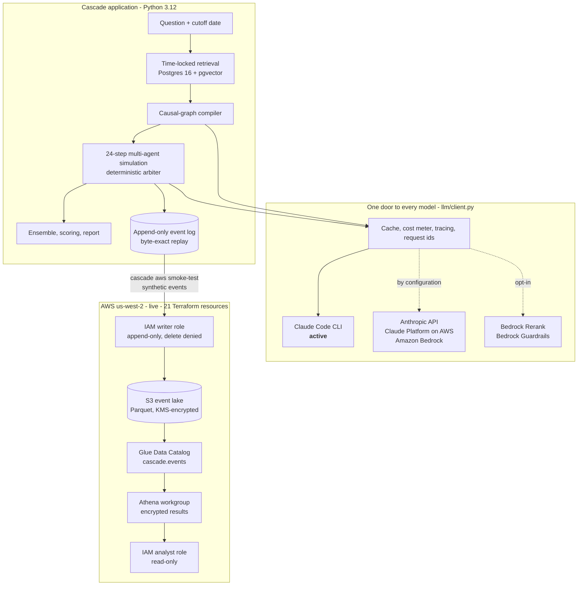

# Architecture

Cascade has three parts: an application that turns a question into a scored
forecast, a single audited door through which every model is reached, and an
AWS analytics plane where the simulation's event log lands.

<p align="center">
  
</p>

Solid green is running today. Dashed is implemented and switched on by
configuration. A PNG of the same diagram, for slides, is at
[assets/cascade-architecture.png](assets/cascade-architecture.png).

The same structure as a Mermaid diagram, which GitHub renders from text:



- [Component responsibilities](#component-responsibilities)
- [Data flow](#data-flow)
- [The provider layer](#the-provider-layer)
- [The AWS analytics plane](#the-aws-analytics-plane)
- [IAM separation](#iam-separation)
- [Terraform profiles](#terraform-profiles)
- [What runs where](#what-runs-where)
- [Design rules](#design-rules)

## Component responsibilities

| Component | Package | Responsibility |
|---|---|---|
| **Ledger** | `cascade/ledger/` | Builds and seals the registry of 180 resolved, binary backtest questions, with base-rate and domain controls; the seal is re-hashed before any label is read |
| **Corpus** | `cascade/corpus/` | Fetches, deduplicates, chunks and embeds the evidence: 1,998,127 chunks, every one dated by when its text was knowable |
| **Chronofence** | `cascade/retrieval/` | Time-locked hybrid retrieval (vector + keyword). `as_of` has no default anywhere; the filter `published_at < as_of` lives in the database |
| **Lathe** | `cascade/decompose/` | Compiles a question into a validated causal graph: actors with objectives and levers, world factors, a monotone outcome rule |
| **Aperture** | `cascade/aperture/` | Derives what each actor can observe from the graph's topology, with noise and lag |
| **Loom** | `cascade/sim/` | The 24-step simulation kernel. Agents decide; a deterministic arbiter — pure Python, no I/O, no model — applies the decisions |
| **Chorus** | `cascade/ensemble/` | Runs replicates in lockstep and collapses them into a forecast with its dispersion |
| **Assay** | `cascade/eval/` | Scoring (Brier, calibration, AUC), baselines, paired bootstrap, the guardrail audit, the report |
| **Strata** | `cascade/trace/` | The append-only event log, cross-process replay, provenance chains, the cost ledger, and the AWS lake smoke test |
| **LLM** | `cascade/llm/` | The one call site for every model and every model-serving AWS service |

## Data flow

1. **A question and its cutoff date** come from the sealed registry.
2. **Chronofence retrieves evidence** that was published strictly before the
   cutoff. The simulation's database role cannot read the outcomes table at
   all: that is a Postgres grant, not a convention.
3. **Lathe compiles the causal graph** through draft, critique and repair
   passes, and a validator rejects graphs that restate the outcome or
   duplicate a factor.
4. **Loom simulates 24 steps.** Each step: the world moves, actors observe
   their partial view, active actors choose an action through the model door,
   and the arbiter folds the actions into the next state. One seeded random
   stream per run, drawn in a documented order.
5. **Every decision is an event**: an append-only row with what it responded
   to and what it changed.
6. **Chorus aggregates** replicates into a probability; **Assay scores** it
   against the resolved outcome, which only the evaluation role can read.
7. **The event log's schema is mirrored in AWS.** The Glue table
   `cascade.events` has the same 13 columns as the Postgres table, and a test
   holds the two equal.

Reproducibility is structural. A run's identifier is derived from its inputs,
every model call is content-addressed and replayed from disk, and
`cascade trace replay` re-runs stored runs in fresh interpreters and compares
event-log hashes byte for byte.

## The provider layer

Every model call goes through `cascade/llm/client.py`. A static test fails CI
if the provider SDK is imported anywhere else, or if a client for a
model-serving AWS service is built anywhere else.

| Provider (`LLM_PROVIDER`) | Class | Auth | Status |
|---|---|---|---|
| `claude_cli` | `ClaudeCliProvider` | The local Claude Code login; this project never reads the token | **Active** |
| `anthropic` | `AnthropicApiProvider` | API key | Implemented; the pinned study configuration |
| `claude_platform_aws` | `ClaudePlatformAwsProvider` | IAM / SigV4 | Implemented, tested against the real SDK; enabled by configuration |
| `bedrock` | `BedrockProvider` | IAM / SigV4 | Implemented, tested against the real SDK |

All four implement one interface, `ModelProvider`, so the cache, the cost
meter, the tracer and replay are written once. Switching is two lines of
configuration:

```bash
LLM_PROVIDER=claude_platform_aws
ANTHROPIC_AWS_WORKSPACE_ID=wrkspc_...
```

Two Amazon Bedrock services sit behind the same door:

- **Bedrock Rerank** (`amazon.rerank-v1:0`) is a second ranking stage. It is
  handed document bodies the database already filtered by date and returns
  scores, so it can reorder the pool but can never widen it.
- **Bedrock Guardrails** screens compiled graphs after compilation, as an
  audit. It never edits a graph in flight, which keeps the measurement
  honest: *not assessed* and *assessed and clear* stay different answers.

Each call keeps the provider's request ID on the result, the recording and
the trace, and `observability.call_log` appends one JSON line per call.

## The AWS analytics plane

Deployed in `us-west-2` by Terraform: 21 resources.

| Resource | Purpose | Settings that matter |
|---|---|---|
| KMS key | Encrypts the lake, query results and the alerts topic | Customer managed, rotation on |
| S3 events bucket | The event lake, Parquet under `events/config_id=<cell>/` | Versioned, all public access blocked, TLS only |
| S3 results bucket | Athena query results | Encrypted, expires after 7 days |
| Glue database and table | `cascade.events`, 13 columns, partitioned by `config_id` | External table over the lake |
| Athena workgroup | The only way to query | Enforced settings, encrypted results, 10 GiB scan limit per query |
| IAM writer role | Appends events | `PutObject` only; every delete denied |
| IAM analyst role | Queries events | Read-only; one table; one workgroup |
| SNS topic | Alerts | Encrypted with the platform key |

The account also carries a multi-region CloudTrail trail, an AWS Budget, Cost
Anomaly Detection and a Bedrock Guardrail. They were in place before the
deployment, are read by `cascade aws check`, and are left unchanged by
Terraform through three explicit switches.

## IAM separation

The lake repeats the role split the database uses (`cascade_sim` writes
events, `cascade_eval` reads outcomes):

| | Writer role | Analyst role | Operator |
|---|---|---|---|
| Put an event object | ✅ | — | — |
| Delete an object or version | **explicitly denied** | — | — |
| Register a partition | — | — | ✅ |
| Query through the workgroup | — | ✅ | — |
| Change the catalog or the workgroup | — | — | ✅ |

This is exercised, not just declared. `cascade aws smoke-test` assumes the
writer role, writes, and then asks it to delete: the run fails unless AWS
answers `AccessDenied`. It then assumes the analyst role for the query, so
both policies are tested against the real service on every run.

## Terraform profiles

One codebase: three roots and 15 modules.

| Root | What it holds |
|---|---|
| `envs/bootstrap` | The state bucket and its key |
| `envs/platform` | Cost governance, the event lake, the audit tier, recovery, reports, guardrails |
| `envs/sandbox` | An isolated VPC, Aurora PostgreSQL Serverless v2 with pgvector, Fargate tasks, Step Functions pipelines |

In the platform root every production tier is a switch that defaults to on.
The committed `portfolio.tfvars` turns them off for a low-cost live
deployment, without removing any module.

| Tier | Switch | Full configuration | Live deployment |
|---|---|:-:|:-:|
| Event lake, KMS, roles, alerts topic | always | ✅ | ✅ |
| Object Lock on the lake and reports | `enable_object_lock` | ✅ | off |
| Recovery archive, cross-region replica | `enable_recovery` | ✅ | off |
| Reports bucket | `enable_reports` | ✅ | off |
| GuardDuty | `enable_guardduty` | ✅ | off |
| AWS Config | `enable_config` | ✅ | off |

Offline gates need no AWS account: `terraform test` with mock providers (131
runs for the platform root, 62 for the sandbox), TFLint, and Checkov with
1,027 passing checks and none failing.

## What runs where

| | Where | Status |
|---|---|---|
| Simulation, retrieval, evaluation | The operator's machine: Python, Postgres 16 + pgvector | Running |
| Claude inference | The local Claude Code CLI | Active |
| Event lake: S3, Glue, Athena, KMS, IAM, SNS | AWS `us-west-2` | Deployed; round trip proven with synthetic events |
| Bedrock Rerank, Bedrock Guardrails | AWS `us-west-2` | Integrated; resolved live by `cascade aws check`; opt-in |
| Claude Platform on AWS, Anthropic API, Bedrock inference | — | Implemented behind the provider interface |
| Recovery, Object Lock, GuardDuty, Config, reports, Aurora sandbox | — | In the Terraform; not deployed |

## Design rules

Nine invariants, each enforced by a test rather than by intention:

1. `as_of` is never defaulted, in Python or in SQL.
2. The simulation never reads the outcome labels: a database grant.
3. The arbiter contains no model call and no I/O.
4. One random stream per run, seeded once, drawn in a fixed order.
5. One call site for every model and every model-serving AWS service.
6. The event log is append-only.
7. All iteration over collections is sorted.
8. Every phase is resumable.
9. No target value is ever written into a report code path.

## Going deeper

- [Decision records](adr/README.md): 54 ADRs, each with its evidence and cost
- [Threat model](architecture/threat-model.md)
- [Well-Architected review](architecture/well-architected.md)
- [Disaster-recovery runbook](architecture/dr-runbook.md)
- [Infrastructure runbook](../infra/terraform/README.md)
- [Platform design notes](architecture/README.md)
