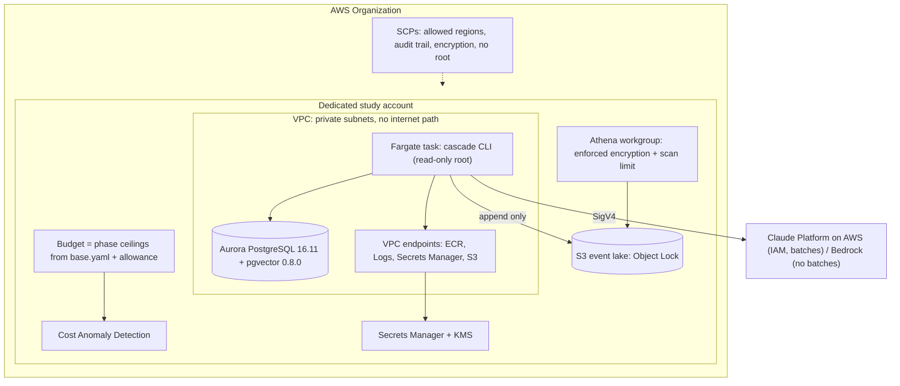

# Cascade on AWS — architecture

How the study runs on AWS, and why each piece is there. Decisions:
[ADR-0028](../adr/0028-model-providers-behind-one-door.md) (model access),
[ADR-0033](../adr/0033-infrastructure-as-code-terraform.md) (IaC and gates),
[ADR-0034](../adr/0034-aurora-data-plane.md) (data plane),
[ADR-0035](../adr/0035-platform-design.md) (platform).

> **Status: designed and gated offline. Nothing here has been applied**, because
> no AWS account has been available. Every property below marked *tested* is
> asserted by `terraform test` against mock providers or by the pytest suite —
> which proves the configuration says what it should, not that AWS accepts it.

## The shape

## Why it is shaped this way

| Decision | Reason | Enforced by |
|---|---|---|
| One dedicated account for the study | Model spend via Claude Platform on AWS bills through Marketplace, where cost-allocation tags do not reach; only an account boundary makes "the study's spend" a number a budget can see | `modules/governance` |
| Budget limits read from `configs/base.yaml` | The in-process meter and the AWS-side alarm cannot drift apart | tested, including against a fixture config (a hardcoded value survived the first test and was caught by mutation) |
| No internet path in the VPC | The bench measures the database, not the network; and there is no egress to exfiltrate through | static pytest check |
| The bench runs inside the VPC | A p95 measured over the internet measures the internet | `modules/bench` |
| pgvector pinned by pinning Aurora 16.11 | The Aurora numbers must compare against local pgvector 0.8.0 | tested: 16.6 is refused |
| Event log under S3 Object Lock, writer denied delete | Invariant 6 (append-only) as two independent controls | tested |
| Labels never enter the lake | Invariant 2: nothing to read, so nothing to guard | by construction |
| Claude Platform on AWS carries simulate; Bedrock does not | Bedrock has no Message Batches API, and simulate fits its ceiling only at the batch rate | `complete_batch` refuses, tested |
| Bedrock Knowledge Bases not used | A managed KB cannot enforce the `as_of` time lock at the storage layer | [ADR-0030](../adr/0030-knowledge-bases-rejected-guardrails-deferred.md) |

## Project invariants, as AWS controls

| Invariant | Locally | On AWS |
|---|---|---|
| 1 — `as_of` never defaulted | required argument in Python and SQL | unchanged: Chronofence is the same SQL on Aurora; **region never defaulted** applies the same rule to where spend lands |
| 2 — simulation never reads labels | Postgres grant | the same grant on Aurora, plus separate IAM roles for the lake; labels are never exported |
| 5 — one model call site | one SDK importer | unchanged: all AWS clients ship in the `anthropic` package |
| 6 — event log append-only | INSERT-only grant | Object Lock + an explicit Deny on delete and lock overrides |
| 8 — every phase resumable | checkpoints, unit states | unchanged; the ingest's stop rules stop *between* units |

## Further reading

[Threat model](threat-model.md) · [Disaster recovery](dr-runbook.md) ·
[Well-Architected review](well-architected.md) · [Runbook](../../infra/terraform/README.md)
