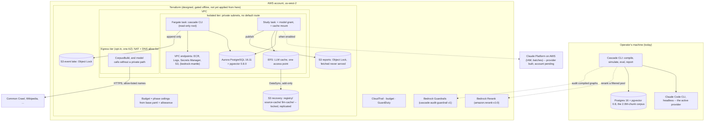

# Cascade on AWS — architecture

How the study runs on AWS, and why each piece is there. Decisions:
[ADR-0028](../adr/0028-model-providers-behind-one-door.md) (model access),
[ADR-0033](../adr/0033-infrastructure-as-code-terraform.md) (IaC and gates),
[ADR-0034](../adr/0034-aurora-data-plane.md) (data plane),
[ADR-0035](../adr/0035-platform-design.md) (platform),
[ADR-0042](../adr/0042-ingest-egress-model-access-and-durable-caches.md)
(the way out, model access, durable caches, the plan workflow, findings),
[ADR-0047](../adr/0047-reranking-is-a-permutation.md) (Bedrock Rerank),
[ADR-0050](../adr/0050-guardrails-measured-not-applied.md) (Bedrock Guardrails),
[ADR-0053](../adr/0053-portfolio-completion-provider-interface-and-region.md)
(the provider interface, one region, and what runs where today).

## What runs where, today

| | Where it runs | Status |
|---|---|---|
| **Claude inference** | the operator's machine, through the locally authenticated Claude Code CLI (`LLM_PROVIDER=claude_cli`) | **active**. Not the pinned configuration; results are labelled as such |
| Claude Platform on AWS | `ClaudePlatformAwsProvider`, IAM/SigV4, batches, us-west-2 | implemented and tested against the real SDK over a mock transport; **not enabled** — account provisioning pending. Switch: `LLM_PROVIDER=claude_platform_aws` + `ANTHROPIC_AWS_WORKSPACE_ID` |
| Bedrock Rerank (`amazon.rerank-v1:0`, us-west-2) | `BedrockReranker`, one `Rerank` call per query over the time-locked pool | integrated, recorded and replayed like a model call; opt-in (`configs/tuning/rerank_bedrock.yaml`); not yet run against the account |
| Bedrock Guardrails (`cascade-audit-guardrail`, version 1, us-west-2) | `BedrockGuardrail` through `ApplyGuardrail`; `cascade eval guardrails` | integrated as a post-hoc audit over compiled graphs, never a filter; not yet run against the account |
| Infrastructure | Terraform, 3 roots and 15 modules, all regional resources in us-west-2 | designed and gated offline (mock-provider tests, TFLint, Checkov under the pinned 1.16.3 in Docker). **Applied, 2026-10-01: the state bucket and the platform root's portfolio profile** -- one CMK, the event lake, the alerts topic, 21 resources (ADR-0054). The full platform and the sandbox are not applied. The account's own CloudTrail, budget, anomaly monitor and audit guardrail were made by hand and are left alone |
| The event lake (S3, Glue, Athena) | the owner's account, us-west-2 | **deployed and proven by `cascade aws smoke-test`**: three synthetic events written by the writer role, read back through the workgroup by the analyst role, rows equal. It holds no real event: nothing exports the event log yet |
| Observability | request ids on every call; `observability.call_log` (JSON lines); Langfuse when configured; CloudTrail in the account | the local parts run today; `cascade trace cost` reconciles when a paid phase exists |

**Claude inference does not run through AWS today.** The provider layer is
built so that it can, without a change to Cascade's core.

## The shape

```mermaid
flowchart TD
  subgraph dev["Operator's machine (today)"]
    cli["Claude Code CLI, headless -- the active provider"]
    local["Cascade CLI: compile, simulate, eval, report"]
    pg[("Postgres 16 + pgvector 0.8, the 2.0M-chunk corpus")]
    local --> cli
    local --> pg
  end
  subgraph acct["AWS account, us-west-2"]
    rerank["Bedrock Rerank (amazon.rerank-v1:0)"]
    guard["Bedrock Guardrails (cascade-audit-guardrail v1)"]
    trail["CloudTrail · budget · GuardDuty"]
    subgraph tf["Terraform (designed, gated offline, not yet applied from here)"]
      budget["Budget = phase ceilings from base.yaml + allowance"]
      subgraph vpc["VPC"]
        subgraph isolated["Isolated tier: private subnets, no default route"]
          task["Fargate task: cascade CLI (read-only root)"]
          study["Study task: + model grant, + cache mount"]
          aurora[("Aurora PostgreSQL 16.11 + pgvector 0.8.0")]
          efs[("EFS: LLM cache, one access point")]
          ep["VPC endpoints: ECR, Logs, Secrets Manager, S3, (bedrock-mantle)"]
        end
        subgraph egress["Egress tier (opt-in, one AZ): NAT + DNS allow-list"]
          fetch["CorpusBuild, and model calls without a private path"]
        end
      end
      lake[("S3 event lake: Object Lock")]
      recovery[("S3 recovery: registry/ source-cache/ llm-cache/ -- locked, replicated")]
      reports[("S3 reports: Object Lock, fetched never served")]
    end
  end
  platform["Claude Platform on AWS (IAM, batches) -- provider built, account pending"]

  local -. "rerank a filtered pool" .-> rerank
  local -. "audit compiled graphs" .-> guard
  study -. "when enabled" .-> platform
  task --> aurora
  study --> aurora
  study --> efs
  task --> ep
  task -->|append only| lake
  study -->|publish| reports
  fetch -->|HTTPS, allow-listed names| sources["Common Crawl, Wikipedia, ..."]
  efs -->|DataSync, add-only| recovery
```

## Why it is shaped this way

| Decision | Reason | Enforced by |
|---|---|---|
| One call site, four provider classes behind one interface | Caching, metering, tracing and replay are written once; a provider is a class in `cascade/llm/client.py` and a row in a registry, chosen by `LLM_PROVIDER` | `tests/unit/test_invariants.py` refuses a second SDK importer or a second model-service `boto3` client; `tests/unit/test_llm_providers.py` holds every class to the interface |
| The CLI provider is local-only and keyed apart | It authenticates as the person logged in to Claude Code, which is not an identity for cloud infrastructure, and it cannot honour `temperature` or `max_tokens` | its own cache namespace (ADR-0031); the study Terraform's `model_provider` refuses the CLI provider |
| One region, written down | Where spend lands is a decision; `us-west-2` is in `configs/base.yaml` and both roots' `terraform.tfvars.example`, and no Terraform `region` has a default | `tests/unit/test_infra_invariants.py`; `tests/unit/test_config.py` |
| The workspace id may come from `ANTHROPIC_AWS_WORKSPACE_ID`; the region may not | The brief's two-variable switch, admitted through `Settings` so `doctor` shows it and a reviewed `CASCADE_` value outranks it; an ambient region could redirect spend silently | tested (ADR-0053) |
| Bedrock Rerank is admissible; Bedrock Knowledge Bases are not | A knowledge base replaces the `published_at < as_of` filter; a reranker permutes a set the database already filtered and is handed bodies, not ids | the poison-pill probe runs *through* the rerank path; property tests hold every reranker to a permutation (ADR-0047) |
| The guardrail is measured, not applied | A filter inside compilation is unmeasurable by construction: the graph it changed would be the only one that existed. The audit keeps *not assessed* apart from *clear* | four verdicts, tested (ADR-0050) |
| One dedicated account for the study | Model spend via Claude Platform on AWS bills through Marketplace, where cost-allocation tags do not reach | `modules/governance` |
| Budget limits read from `configs/base.yaml` | The in-process meter and the AWS-side alarm cannot drift apart | tested, including against a fixture config |
| No internet path in the VPC by default | The bench measures the database, not the network; and there is no egress to exfiltrate through | static pytest check |
| The way out is one opt-in tier | The ingest must reach the public internet; a NAT with a DNS allow-list, not a firewall, because the cost of forgetting a firewall for a month is most of the study's budget | tested under mocks and statically |
| The study task is a second task definition | The bench must never call a model; model permissions are per provider: three routes in one workspace, one action in one region, or a key as an ECS secret | tested |
| The LLM cache is an EFS file system, copied add-only into the recovery bucket | Every recording is money already spent | tested |
| Service control policies are optional | They can only be created from an Organizations management account; a standalone account keeps the rest of the root | `create_service_control_policies` (ADR-0053) |
| `terraform plan` on pull requests through OIDC; apply is a person | A stored key is long-lived and leaks; the plan role is read-only | tested: permissions, gating, SHA-pinned actions, no `apply` |
| pgvector pinned by pinning Aurora 16.11 | The Aurora numbers must compare against local pgvector 0.8.0 | tested: 16.6 is refused |
| Event log under S3 Object Lock, writer denied delete | Invariant 6 (append-only) as two independent controls | tested |
| Claude Platform on AWS carries simulate; Bedrock does not | Bedrock has no Message Batches API, and simulate fits its ceiling only at the batch rate | `complete_batch` refuses, tested |

## Project invariants, as AWS controls

| Invariant | Locally | On AWS |
|---|---|---|
| 1 — `as_of` never defaulted | required argument in Python and SQL | unchanged: Chronofence is the same SQL on Aurora; **region never defaulted** applies the same rule to where spend lands; the reranker has no argument through which a date could reach it |
| 2 — simulation never reads labels | Postgres grant | the same grant on Aurora, plus separate IAM roles for the lake; an explicit Deny on `registry/*` and `source-cache/*` in the recovery bucket for the study task's role |
| 5 — one model call site | one SDK importer, one builder of model-service `boto3` clients, four provider classes behind one interface | unchanged: the AWS clients ship in the `anthropic` package; `ApplyGuardrail`, `Rerank` and the control-plane reads of `cascade aws check` are built in the same module |
| 6 — event log append-only | INSERT-only grant | Object Lock + an explicit Deny on delete and lock overrides |
| 8 — every phase resumable | checkpoints, unit states | unchanged; the ingest's stop rules stop *between* units |

## Further reading

[Threat model](threat-model.md) · [Disaster recovery](dr-runbook.md) ·
[Well-Architected review](well-architected.md) · [Runbook](../../infra/terraform/README.md)
