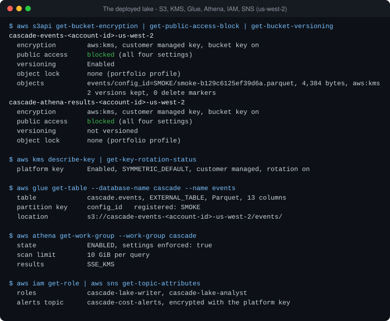
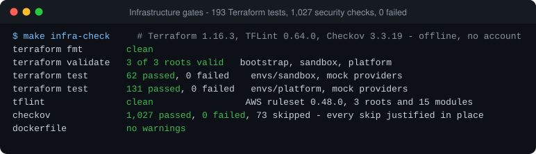
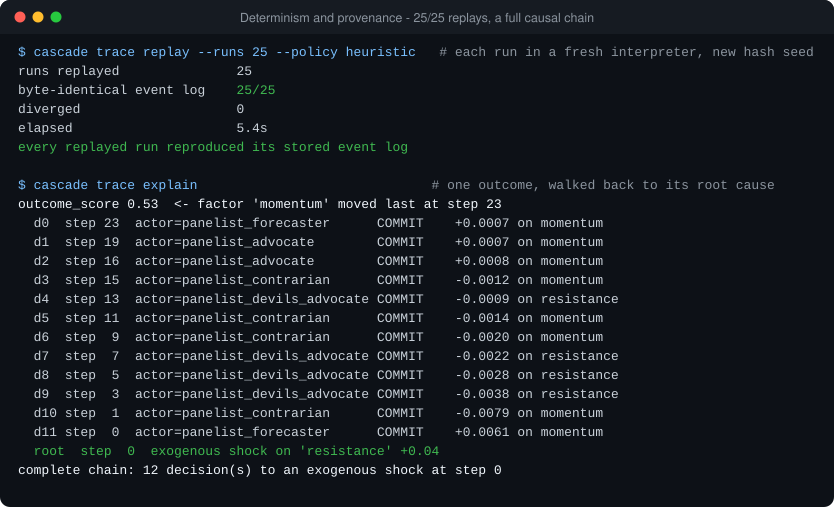
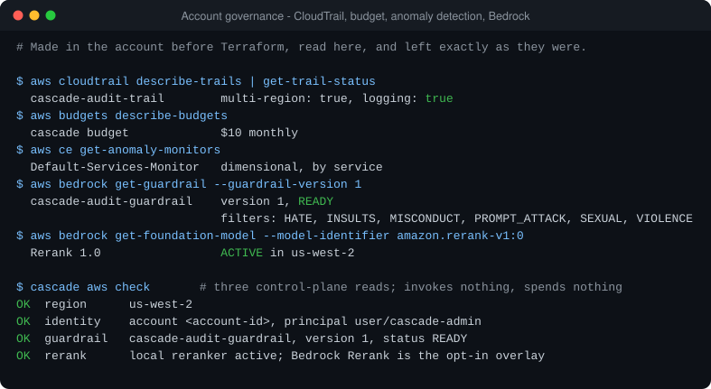

# Evidence pack

Proof artifacts for every claim on the repository's front page, captured on
**2026-10-02 (UTC)** from `main` at `f4458da` and from the live AWS account
in `us-west-2`.

**How these were made.** Each artifact is the output of the command named
beside it, reduced to the fields shown. Every value was read from what the
command returned; none was typed by hand. Each has two files: a `.txt`
capture and an `.svg` rendering of that same text.

**What was removed.** The AWS account ID, the KMS key ID, IP addresses and
local file paths are replaced with placeholders such as `<account-id>`. No
credential, token, session secret or signed URL appears in any file; request
IDs are kept because they are how a call is traced, and they grant nothing.

**What these are not.** They are command-line captures, not AWS Console
screenshots: the console needs an interactive login that was not part of
this capture. The same facts can be read in the console under S3, Glue,
Athena, IAM and KMS.

## Index

| # | Artifact | What it proves |
|---|---|---|
| 1 | [aws-smoke-test](#1-the-live-smoke-test) | The deployed lake works end to end, as its own IAM roles |
| 2 | [athena-roundtrip](#2-the-athena-round-trip) | Three rows written are the three rows returned |
| 3 | [terraform-no-drift](#3-terraform-applied-with-no-drift) | 21 resources applied; the next plan shows no changes |
| 4 | [least-privilege](#4-least-privilege-tested-live) | The writer's delete is refused by the live policy |
| 5 | [aws-resources](#5-the-deployed-resources) | Encryption, public-access blocks, catalog and workgroup settings |
| 6 | [quality-gates](#6-quality-gates) | Tests, strict typing, replay and CI |
| 7 | [infra-security](#7-infrastructure-and-security-gates) | 193 Terraform tests and 1,027 security checks, none failing |
| 8 | [replay-and-provenance](#8-determinism-and-provenance) | Runs replay byte for byte; outcomes trace to a root cause |
| 9 | [account-governance](#9-account-governance-and-bedrock) | CloudTrail, budget, anomaly detection and the Bedrock surfaces |

Diagrams are in [`../assets`](../assets): the
[architecture diagram](../assets/cascade-architecture.svg), the
[smoke-test flow](../assets/aws-proof-flow.svg) and the
[repository banner](../assets/cascade-github-banner.png).

---

## 1. The live smoke test


`cascade aws smoke-test` — [text](aws-smoke-test.txt)

Ten steps, all OK. The writer role puts three synthetic events as one
4,384-byte Parquet file, encrypted under the platform KMS key. The same role
is then refused a delete. The partition is registered, the analyst role
queries through the workgroup, and the three rows returned equal the three
written. Every AWS call carries its request ID. The events are labelled
synthetic in every field; this is a proof of the path, not an export of the
real event log.

## 2. The Athena round trip


`aws athena get-query-execution` and `get-query-results` for the smoke
test's query — [text](athena-roundtrip.txt)

Read back from Athena after the fact: the query the analyst role ran, its
state, 953 bytes scanned, 427 ms of engine time, results encrypted with
SSE-KMS, and the three rows.

## 3. Terraform, applied with no drift


`terraform apply platform.tfplan`, `terraform plan -var-file=portfolio.tfvars`,
`terraform state list` — [text](terraform-no-drift.txt)

The portfolio profile was applied from a saved, reviewed plan: 21 added, 0
changed, 0 destroyed. The plan run on 2026-10-02 reports no changes. The
state holds exactly 21 managed resources: one KMS key, 18 for the event lake,
two for the alerts topic. A later one-line policy update (0 added, 1 changed,
0 destroyed) is included in the no-drift result.

## 4. Least privilege, tested live


`aws iam get-role-policy` for both roles, and the smoke test's delete step —
[text](least-privilege.txt)

The writer's policy allows `s3:PutObject` under `events/` and explicitly
denies every delete and every lock override. The second block is the live
result: `DeleteObject`, attempted as that role, refused with `AccessDenied`.
The analyst's policy is read-only: Athena through one workgroup, Glue reads
on one table.

## 5. The deployed resources



`aws s3api`, `aws kms`, `aws glue`, `aws athena`, `aws iam`, `aws sns`
read-only calls — [text](aws-resources.txt)

Both buckets are encrypted with the customer-managed key and have all four
public-access blocks on. The key is enabled with rotation on. The Glue table
`cascade.events` has 13 columns and is partitioned by `config_id`. The Athena
workgroup enforces its settings, encrypts results and caps a query at 10 GiB.
No bucket carries Object Lock in this profile.

## 6. Quality gates


`make ci`, `cascade trace replay`, `gh run list` — [text](quality-gates.txt)

ruff, black and mypy strict are clean; 2,533 tests pass; 25 of 25 stored
runs replay byte-identically; all three CI jobs are green on `main`.

## 7. Infrastructure and security gates



`make infra-check` — [text](infra-security.txt)

Run offline with pinned tool versions and mock providers, so it needs no AWS
account: format and validation clean across three roots, 62 and 131 Terraform
tests passing, TFLint clean, and Checkov with 1,027 checks passed and none
failed.

## 8. Determinism and provenance



`cascade trace replay --runs 25 --policy heuristic`, `cascade trace explain`
— [text](replay-and-provenance.txt)

Each of 25 stored runs is re-run in a fresh interpreter under a different
hash seed and reproduces its event log exactly. The second block walks one
run's outcome back through 12 decisions to the external shock that started
it. These runs use the deterministic stand-in agents, which need no model.

## 9. Account governance and Bedrock



`aws cloudtrail`, `aws budgets`, `aws ce`, `aws bedrock` read-only calls and
`cascade aws check` — [text](account-governance.txt)

The account's multi-region trail, monthly budget and cost-anomaly monitor
were in place before the deployment and are unchanged by it. The Bedrock
guardrail is READY at version 1, and the rerank model is ACTIVE in the
region. `cascade aws check` resolves all of it without invoking a model.

---

## Reproducing these

```bash
make ci                                               # 6
make infra-check                                      # 7  (re-initialises the Terraform roots without a backend)
cascade trace replay --runs 25 --policy heuristic     # 8
cascade trace explain                                 # 8
export AWS_PROFILE=<your-profile>
cascade aws check                                     # 9
cascade aws smoke-test --record .logs/aws-smoke.json  # 1, 2, 4
cd infra/terraform/envs/platform
terraform plan -var-file=portfolio.tfvars             # 3
```
